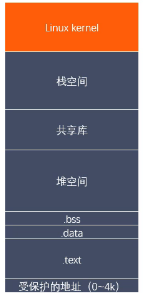
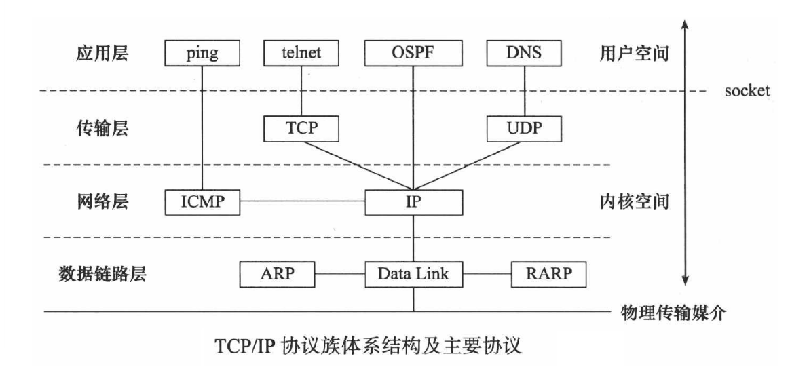

# 一、Linux编程入门

## 静态库和动态库的制作使用

### 静态库

命名：libxxx.a

制作过程：1. gcc获得.o文件    

​		 2.使用ar工具(archive)讲.o文件打包   ar rcs libxxx.a xxx.o xxx.o   

​                                         (r 将文件插入备存文件中 c简历备存文件 s索引)

### 动态库

命名：libxxx.so
		制作过程：1.gcc得到.o文件，和位置无关的代码   gcc -c -fpic a.c b.c

​            		2.gcc得到动态库   gcc -shared a.o b.o -o libxxx.so

### 对比：

静态库： GCC 进行链接时，会把静态库中代码打包到可执行程序中。
		动态库： GCC 进行链接时，动态库的代码不会被打包到可执行程序中。

静态库的优缺点：

优点：静态库被打包到应用程序中加载速度快，发布程序无需提供静态库，移植方便程序
		缺点：消耗系统资源，浪费内存更新、部署、发布麻烦

动态库的优缺点

优点：可以实现进程间资源共享（共享库）更新、部署、发布简单，可以控制何时加载动态库

缺点：加载速度比静态库慢，发布程序时需要提供依赖的动态库

# 二、多进程开发

## 进程状态转换

## 进程的调度

## 进程间通信方式

### 匿名管道

### 有名管道

### 内存映射

### 信号

### 共享内存

#### 问题：

##### 问题1：操作系统如何知道一块共享内存被多少个进程关联？

  \- 共享内存维护了一个结构体struct shmid_ds 这个结构体中有一个成员 shm_nattch

  \- shm_nattach 记录了关联的进程个数


##### 问题2：可不可以对共享内存进行多次删除 shmctl

  \- 可以的，因为shmctl 标记删除共享内存，不是直接删除

  \- 什么时候真正删除呢?

​    当和共享内存关联的进程数为0的时候，就真正被删除

  \- 当共享内存的key为0的时候，表示共享内存被标记删除了

​    如果一个进程和共享内存取消关联，那么这个进程就不能继续操作这个共享内存。也不能进行关联。


#####   问题3：共享内存和内存映射的区别

  1.共享内存可以直接创建，内存映射需要磁盘文件（匿名映射除外）

  2.共享内存效果更高

  3.内存

​    所有的进程操作的是同一块共享内存。

​    内存映射，每个进程在自己的虚拟地址空间中有一个独立的内存。

#####   问题4.数据安全

​    \- 进程突然退出

​      共享内存还存在

​      内存映射区消失

​    \- 运行进程的电脑死机，宕机了

​      数据存在在共享内存中，没有了

​      内存映射区的数据 ，由于磁盘文件中的数据还在，所以内存映射区的数据还存在。


#####   问题5.生命周期

​    - 内存映射区：进程退出，内存映射区销毁

​    \- 共享内存：进程退出，共享内存还在，标记删除（所有的关联的进程数为0），或者关机

​      如果一个进程退出，会自动和共享内存进行取消关联。

#### 共享内存操作命令

##### ipcs 用法

- ipcs -a // 打印当前系统中所有的进程间通信方式的信息
- ipcs -m // 打印出使用共享内存进行进程间通信的信息
- ipcs -q // 打印出使用消息队列进行进程间通信的信息
- ipcs -s // 打印出使用信号进行进程间通信的信息

##### ipcrm 用法

- ipcrm -M shmkey // 移除用 shmkey 创建的共享内存段
- ipcrm -m shmid // 移除用 shmid 标识的共享内存段
- ipcrm -Q msgkey // 移除用 msqkey 创建的消息队列
- ipcrm -q msqid // 移除用 msqid 标识的消息队列
- ipcrm -S semkey // 移除用 semkey 创建的信号
- ipcrm -s semid // 移除用 semid 标识的信号

#### 进程内存空间组成



## 守护进程

## 协程

协程，是一种比线程更加轻量级的存在，协程不是被操作系统内核所管理，而完全是由程序所控制（也就是在用户态执行）。这样带来的好处就是性能得到了很大的提升，不会像线程切换那样消耗资源。

子程序其实是协程的特例

协程的特点在于是一个线程执行。极高的执行效率：因为子程序切换不是线程切换，而是由程序自身控制，因此，没有线程切换的开销，和多线程比，线程数量越多，协程的性能优势就越明显；

不需要多线程的锁机制：因为只有一个线程，也不存在同时写变量冲突，在协程中控制共享资源不加锁，只需要判断状态就好了，所以执行效率比多线程高很多

在协程中控制共享资源不加锁，但是协程内部操作共享资源还是要加锁

# 三、多线程

## 进程、线程、协程区别

进程：是并发执行的程序在执行过程中分配和管理资源的基本单位，是一个动态概念，竞争计算机系统资源的基本单位。 

线程：是进程的一个执行单元，是进程内可调度实体。处理器调度的基本单位i。比进程更小的独立运行的基本单位。线程也被称为轻量级进程。

协程：是一种比线程更加轻量级的存在。一个线程也可以拥有多个协程。其执行过程更类似于子例程，或者说不带返回值的函数调用。

进程和线程的根本区别在于隔离性，互不信任的多个任务应当放到多个进程中实现强隔离。

地址空间：线程共享本进程的地址空间，而进程之间是独立的地址空间。

资源：线程共享本进程的资源如内存、I/O、cpu等，不利于资源的管理和保护，而进程之间的资源是独立的，能很好的进行资源管理和保护。

健壮性：多进程要比多线程健壮，一个进程崩溃后，在保护模式下不会对其他进程产生影响，但是一个线程崩溃整个进程都死掉。

执行过程：每个独立的进程有一个程序运行的入口、顺序执行序列和程序入口，执行开销大。

但是线程不能独立执行，必须依存在应用程序中，由应用程序提供多个线程执行控制，执行开销小。

切换时：进程切换时，消耗的资源大，效率高。所以涉及到频繁的切换时，使用线程要好于进程。同样如果要求同时进行并且又要共享某些变量的并发操作，只能用线程不能用进程。


**协程和线程的区别**

协程避免了无意义的调度，由此可以提高性能，但程序员必须自己承担调度的责任。同时，协程也失去了标准线程使用多CPU的能力。

**线程**

相对独立

有自己的上下文

切换受系统控制；

**协程**

相对独立

有自己的上下文

切换由自己控制，由当前协程切换到其他协程由当前协程来控制。


**何时使用多进程，何时使用多线程？**


对资源的管理和保护要求高，不限制开销和效率时，使用多进程。

要求效率高，频繁切换时，资源的保护管理要求不是很高时，使用多线程。


## 线程同步

## 互斥锁

## 悲观锁

## 读写锁

## 生产者消费者模型

## 线程池

初始化线程池,设定线程个数,请求队列大小,依次创建线程,传入回调函数参数(this指针,线程池指针,可以共享信号量,互斥锁等),并设置为线程分离.

调用append将任务加入请求队列,使用互斥锁,保证线程安全.加入队列后,对信号量V操作,告知有新的任务加入队列.

线程池运行函数,停止运行标志为假时,一直运行,首先执行信号量P操作,等待信号量通知,然后加锁获取队列中首个元素,弹出队首元素,解锁.执行任务处理函数,


http

向epoll添加文件描述符,设置水平触发, epolloneshot,避免正在读写操作,被后续到达的同一个文件描述符打断.设置文件描述符非阻塞

重置文件描述符 重置oneshot

设置端口复用

 //设置端口复用

  int reuse = 1;

  setsockopt(m_sockfd, SOL_SOCKET, SO_REUSEADDR, &reuse, sizeof(reuse));

# 四、Linux网络编程开发

## 常用命令

### 查看网络相关命令

netstat

​	参数：

​		-a 所有的socket

​		-p 显示正在使用socket的程序的名称

​		-n 直接显示IP地址，而不通过域名服务器

​		-l 显示正在监听服务器的socket

​		-t 使用TCP的socket

​		-u 使用UDP的socket

## 端口


###  端口类型

1.常用端口 0~1023  (两个字节  0开头)

| FTP  | SSH  | Telnet | SMTP | DNS  | HTTP | pop3 | HTTPS |
| ---- | ---- | ------ | ---- | ---- | ---- | ---- | ----- |
| 21   | 22   | 23     | 25   | 53   | 80   | 110  | 443   |

2.注册端口  1024~49151  (两个字节 10开头 1000 0000 0000 0000 ~ 1011 1111 1111 1111 )

3.私有端口/动态端口 49152~65535 (1100 0000 0000 0000 ~ 1111 1111 1111 11111)

### SO_REUSEADDR/SO_REUSEPORT

#### SO_REUSEADDR套接字有以下功能：

- 允许启动一个监听服务器并捆绑其所周知的端口，即使以前建立的使用该端口的连接还存在。

  > 可以解决服务器重启时之前绑定的端口还未释放。
  >
  > 解决程序突然退出系统而没有释放端口。

- 允许同一端口上启动同一服务器的多个实例，只要每个实例绑定一个不同的本地IP即可。

  > 这种对IP别名技术托管多个HTTP服务器的网点是常见的。举例：本地主机主IP地址192.69.10.2，有198.69.10.128和198.69.10.129两个别名。在其上启动三个HTTP服务器，第一个HTTP服务器以本地通配IP地址INADDR_ANY和本地端口号80调用bind；第二个HTTP服务器以本地IP地址198.69.10.128和本地端口号80调用bind。这次调用将失败，除非设置了SO_REUSEADDR;第三个HTTP服务器与第二个同理。目的地址为192.69.10.128、目的端口号为80的外来TCP连接请求将交给第二个服务器。129将交给第三个，除此之外，所有端口号为80的其他TCP连接将地送给第一个服务器。`不可能启动多个端口和IP地址都相同的服务器`。为了安全起见，有些操作系统要求先启动具体地址的服务器(例如此处128、129)，执行通配地址捆绑的服务器最后一个启动。
  >
  > 多宿主机：具有多个IP层可见接口的主机。
  >
  > 主机可以把多个IP地址赋予给单个给定的物理接口。除第一个IP地址即主地址外的每个额外IP地址成为该接口的一个别名地址或逻辑接口地址。
  >
  > 常见端口这样绑定需要超级用户授权。

- 允许单个进程捆绑同一端口到多个套接字上。只要每次捆绑指定不同的本地IP地址即可。

  > 对UDP服务器是普遍的，对希望在一个多目的主机的若干个(而非全部)本地地址上服务连接的TCP服务器进程来说也需要采取这种方法。

- 支持完全重复的捆绑。

  > 这种仅支持UDP套接字。用于多播时，允许在同一个主机上同时运行同一个应用程序的多个副本。

端口复用允许在一个应用程序可以把 n 个套接字绑在一个端口上而不出错。同时，这 n 个套接字发送信息都正常，没有问题。但是，这些套接字并不是所有都能读取信息，只有最后一个套接字会正常接收数据。前提是UDP套接字。

在实际应用中，更新，老的程序执行之前的逻辑 等待执行完手动终止 新的程序接收新的请求

操作系统区分一个socket。采用五元组

<源IP、源端口、目的IP、目的端口、协议>

#### SO_REUSEPORT

并未重载SO_REUSEPORT所需的多播语义(即允许完全重复的捆绑)，而是引入一下语义：

- 本选项允许完全重复的捆绑，不过只有在想要捆绑同一IP地址和端口的每个套接字都指定了本套接字选项才可以。
- 如果被捆绑的IP地址是一个多播地址，那么两者时等效的。

需要注意的是，并未所有操作系统支持，可以改用SO_REUSEADDR。

SO_REUSEADDR有一个潜在的安全问题。 举例来说， 假设存在一个绑定了通配地址和端口5555的套接字，如果指定SO_ REUSEADDR， 我们就可以把相同的端口捆绑到不同的IP地址上，譬如说就是所在主机的主IP地址。此后目 的地为端口5555及新绑定IP地址的数据报将被递送到新的套接字，而不是递送到绑定 了通配地址的已有套接字。 这些数据报可以是TCP的SYN分节、SCTP的NIT块或UDP数据报。（UNIX网络编程习题11.9展示了UDP的这个特性。） 对于大多数众所周知的服务如HTTP、FTP和Telnet来说， 这不成问题， 因为这些服务器绑定的是保留端口。 这种情况下，后来的试图捆绑这些端口更为明确的实例（也就是盗用这些端口） 的任何进程都需要超级用户特权。然而NFS可能是一个问题， 因为它的通常端口（2049） 并不是保留端口。

## 网络协议




## socket通信

定义:网络上不主机上的应用程序之间双向通信的端点的抽象。

常用类型：流式socket(SOCK_STREAM)和数据报socket(SOCK_DGRAM)。

网络中进程之间通过socket通信，利用三元组(ip地址、协议、端口)标识网络中唯一进程。

### I/O模型

分类：

- 阻塞I/O：所有过程都阻塞。

- 非阻塞I/O：buffer中没有数据，立即返回EAGIN、EWOULIDBLOCK。

- I/O复用(select)：在wiat、copy阶段阻塞。

- 信号(事件)驱动I/O(SIGIO):在wiat阶段不阻塞，但在copy阶段阻塞(信号驱动I/O,即通知)

- 异步I/O：AIO

  **阻塞和非阻塞，应该描述的是一种状态，同步与非同步描述的是行为方式.**

#### I/O复用

1. select

调用过程：

- 使用copy_from_user从用户空间拷贝fd_set到内核空间。
- 注册回调函数`__pollwait`
- 调用对应poll方法。
- poll方法返回一个读写是否就绪的mask掩码，根据mask掩码给fd_set赋值。

- 阻塞监听I/O事件，由内核完成。
- 将fd_set拷贝到用户空间

缺点：

- 每次调用select都需要在用户态和内核态之间拷贝监听文件描述符，开销很大。
- 线性扫描，O(n)
- 支持数量太小，默认只有1024
- 监听文件文件描述符不能重用，每次要重置。

2. poll

   解决了select使用pollfd结构(链表),解决了select支持数量太小的问题。

   缺点：大量拷贝，水平触发(当报告fd没有处理时会一直触发，耗费性能)。

3.epoll

同时支持ET、LT模式。前两者只支持LT模式。

- LT：只要事件没有处理完成会一直通知。

- ET：只有新的事件到达时，才会通知。

注意：使用ET模式，必须调用非阻塞接口，避免某事件在阻塞时将其他文件描述符饿死。

调用过程：

- 当调用epoll_wait函数时，会创建一个epoll对象，每个对象有一个结构体与之对应。

  结构体成员：

  - rbn，代表将要通过epoll_ctl向epoll对象中添加的事件，这些事件挂载在红黑树中。
  - rdlist，存放即将发生的事件。

- 文件fd状态改变，触发fd上的函数。

- 回调函数将响应的fd加入rdlist，此时relist不为空，进程被唤醒，epoll_wait继续执行。

- 事件转移函数，将rdlist拷贝到epoll_wait函数的events参数。

- ep_send_events函数，它扫描txlist的每个数据，调用关联fd对应的poll方法去取fd中较新的事件，将取得的事件和对应的fd发送到用户空间。如果fd是LT模式的话，会被txlist的该数据重新放回rdlist，等待下一次继续触发调用。

优点：

- 没有最大并发连接的限制
- 只有活跃可用的fd才会调用callback函数
- 内存拷贝是利用mmap()文件映射内存的方式加速与内核空间的消息传递，减少复制开销。（内核与用户空间共享一块内存）

只有存在大量的空闲连接和不活跃的连接的时候，使用epoll的效率才会比select/poll高

本身时间表就在内核空间，避免了相互拷贝问题。

在连接活跃，监听连接个数相对较少时，使用poll、select效率较高。


IO分两阶段：

> 1.数据准备阶段
>
> 2.内核空间复制回用户进程缓冲区阶段

一般来讲：阻塞IO模型、非阻塞IO模型、IO复用模型(select/poll/epoll)、信号驱动IO模型都属于同步IO，因为阶段2是阻塞的(尽管时间很短)。只有异步IO模型是符合POSIX异步IO操作含义的，不管在阶段1还是阶段2都可以干别的事。

在连接数少并且连接都十分活跃的情况下，select、poll性能更高。因为epoll有大量回调函数


### 提高并发

- 基于线程，一个进程生成多个线程，每个线程去处理客服请求。线程池。
- 使用基于事件的模型，一个进程处理多个请求，通过epoll机制通知用户请求完成
- 支持磁盘的异步IO
- 支持mmp内存映射,直接读取磁盘内容。

## 字节序

小端字节序：数据的高位存储在高位地址，低位字节存储在内存的低位地址、

大端字节序：数据的低位存储在高位地址，高位字节存储在内存的低位地址、

## 服务器端 客户端TCP通信流程


## sockaddr和sockaddr_in

struct sockaddr和struct sockaddr_in这两个结构体用来处理网络通信的地址。 

socket（“套接字”），它是计算机之间进行**通信**的一种约定或一种方式。通过 socket 这种约定，一台计算机可以接收其他计算机的数据，也可以向其他计算机发送数据。
而sockaddr就是保存socket中 网络协议、ip地址、端口号等信息。

sockaddr中的sa_data把目标地址和端口信息混在一起了。而sockaddr_in解决了sockaddr的缺陷，把port和addr 分开储存在两个变量中。为了保持兼容，一般用sockaddr_in 进行复制保存，在传入connect函数时，强转指针类型就可以。

## shutdown 半关闭实现只读，不发送

只关闭socket描述符的读或者写。

如果多个进程共享一个套接字，每调用close()一次，计数减一，直到计数为0，套接字才被释放

而shoutdown 关闭读或者写后 所有相关进程不能读或者写。

## 阻塞/非阻塞、同步/异步(网络IO)

典型一次IO的两个阶段：数据就绪、数据读写。

数据就绪：根据系统IO操作的就绪状态。

- 阻塞
- 非阻塞

数据读写：根据应用程序和内核的交互方式。同步是需要工作线程完成读，写以及任务处理等，而异步是读写等操作交给内核或其他进程，当前进程只关注任务处理。

- 同步
- 异步

在处理IO时，阻塞和非阻塞都是同步IO，只有使用了特殊的API才是异步IO。

词义辨析：同步异步本质上形容的一种流程，没有特定的技术概念。而阻塞/非阻塞出处很明确，描述I/O接口的一个特征，即接口被调用后，在等待真正的结果返回之前，该进程是否会被挂起。 

在进程通信的概念是同义词。

在系统调用层面：

- 非阻塞I/O系统调用read()操作立即返回的是任何可以立即拿到的数据，可以是完整的结果，也可以是不完整的结果，还可以是一个空值。

- 异步I/O系统调用read()结果必须是完整的，但是这个操作完成的通知可以延迟。


### IO模型

这里主要指的是网络IO，服务器对于建立起多个客户端连接的读写。

- 阻塞blocking：调用者调用了某个函数，等待这个函数返回，期间什么也不做，不断检查这个函数有没有返回，必须有返回值才能进行下一步。
- 非阻塞no-blocking：非阻塞等待，每隔一段时间就去检测IO事件是否就绪，没有就绪可以做其他事。
- IO复用：Linux使用select/poll/epoll函数实现I/O复用模型，这些函数也会使进程阻塞，但是和阻塞IO不同的是，这些函数可以同时阻塞多个IO操作。
- 信号驱动：Linux用套接口进行信号驱动IO，安装一个信号处理函数，进程继续运行并不阻塞，当IO事件就绪，进程收到SIGIO信号，然后处理IO事件。
- 异步：Linux中可以调用aio_read函数告诉内核描述字缓冲区指针和缓冲区的大小、文件偏移及通知的方式，然后立即返回，当内核将数据拷贝到缓冲区后，在通知应用程序。


## I/O多路复用(I/O多路转接)

select缺点：1。每次调用select，都需要把fd集合从用户态拷贝到内核态，这个开销在fd很多时会很大同时每次调用select都需要在内核遍历传递进来的所有fd，这个开销在fd很多时也很大。3.select支持的文件描述符数量太小了，默认是1024。4.fds集合不能重用，每次都需要重置。

epoll效率高 1是内核贡献内存，避免了多次拷贝。

### epoll 

#### 使用

首先需要创建一个epollfd,需要使用epoll_creat函数去创建.

```cpp
#include<sys/epoll.h>
int epoll_creat(int size); //size已被弃用,传入大于0的值即可.
```

绑定添加一个fd或者删除一个fd,可以使用epoll_ctl函数:

```cpp
int epoll_ctl(int epfd, int op, int fd, struct epoll_event* event);
```

参数说明:

epfd即epollfd;  

op:操作类型,取值有EPOLL_CTL_ADD, EPOLL_CTL_MOD, EPOLL_CTL_DEL,分别表示添加,修改和删除一个fd.当取值是EPOLL_CTL_DEL时,第四个参数event忽略不计,可以设置为NULL.

参数fd即需要被操作的fd.

参数event,这是一个epoll_event结构体的地址.

红黑树 查找
链表

epoll两种模式ET,LT.

ET触发情况

- 读
  - buffer由不可读变为可读,即空变为不空的时候.
  - 有新的数据到达,即buffer中数据变多的时候.

- 写
  - buffer由不可写变为可写的时候,即buffer由满状态变为不满的时候.
  - 当由旧数据发送走,buffer中待写的内容变少的时候.


epoll_server 使用 ET 模式下即使给客户端 fd 注册了检测可写事件不会一直触发，只会触发一次，触发完后只有再次注册检测可写事件才会继续触发，这里是靠客户端来新消息驱动再次注册检测可写事件。也就是说，如果我们使用 ET 模式去处理可写事件时不必像 LT 模式那样为了避免不必要的可写触发在触发后需要立即移除检测可写事件。

这就意味着，使用 LT 模式，如果你的实现依赖于可写事件触发去发送数据，那么你一定要在数据发送完之后移除检测可写事件，避免没有数据发送时无意义的触发；使用 ET 模式时，如果你的实现也依赖于可写事件触发去发送数据，可写事件触发后，你调用 send 函数（Linux 平台也可以使用 write）去发送数据，如果数据本次不能全部发送完（对于非阻塞的 socket，此时 send 函数返回 -1，错误码为 EAGAIN 或 EWOULDBLOCK），你一定要继续注册检测可写事件，否则你剩余的数据就再也没有机会发送了，因为 ET 模式的可写事件再也不会触发。

> 在目前主流的网络库中，发数据的逻辑都不是上面所说的依赖于写事件触发，在写事件触发时去发数据。这种做法不好，那好的做法是什么呢？我会在后续文章《收数据与发数据的正确做法》中详细介绍。

最后容我再啰嗦几句，总结起来：

- LT 模式下，读事件触发后，可以按需收取想要的字节数，不用把本次接收到的数据收取干净（即不用循环到 recv 或者 read 函数返回 -1，错误码为 EWOULDBLOCK 或 EAGAIN）；ET 模式下，读事件必须把数据收取干净，因为你不一定有下一次机会再收取数据了，即使有机会，也可能存在上次没读完的数据没有及时处理，造成客户端响应延迟。
- LT 模式下，不需要写事件一定要及时移除，避免不必要的触发，浪费 CPU 资源；ET 模式下，写事件触发后，如果还需要下一次的写事件触发来驱动任务（例如发上次剩余的数据），你需要继续注册一次检测可写事件。

## 整体流程

```cpp
//简略版
//创建一个用于监听的socket
int listenfd = socket(AF_INET, SOCK_STREAM, 0);
//设置端口复用
setsockopt(listenfd, SOL_SOCKET, SO_REUSEPORT, &reuse, sizeof(reuse)); //reuse = 1;
//将监听设置为非阻塞的
fcntl(listenfd, F_SETFL, newSocketFlag); // newSocketFlag = oldSocketFlag | O_NONBLOCK;
//初始化服务器地址 并绑定
bind(listenfd, (struct sockaddr*)& binaddr, sizeof(binaddr));
//启动监听
listen(listenfd, SOMAXCONN);
//创建epoll  并初始化加入listenfd,设置EPOLLIN
int epollfd = epoll_create(1);
epoll_event listen_fd_event; //.data.fd = listenda  .events = EPOLLIN
//将监听socket绑定到epollfd上去
epoll_ctl(epollfd, EPOLL_CTL_ADD, listenfd, &listen_fd_event);
//初始化完成,进入循环处理
epoll_wait(epollfd, epoll_events, 1024, 1000); // 根据返回值判断是新连接还是 新数据到达
```

