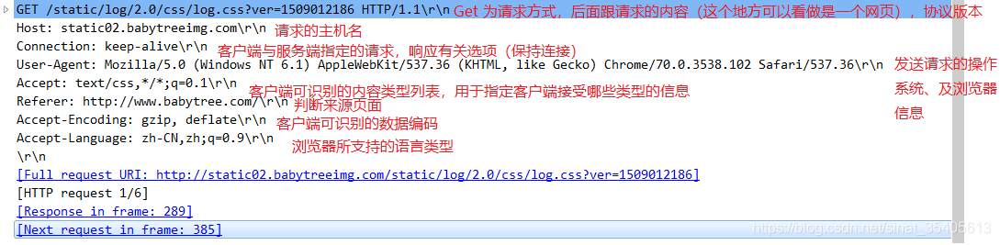
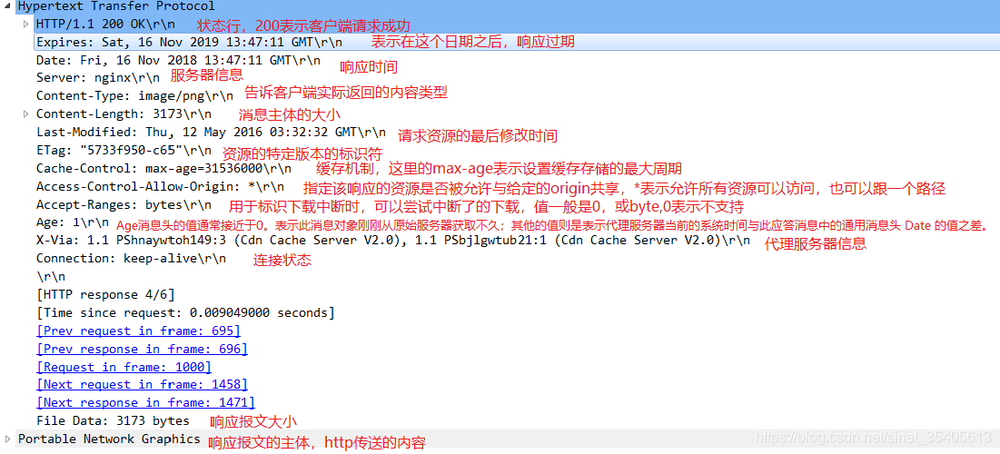

# C++基础

## 关键字

### explicit

指定构造函数或者转换函数为显示，禁止隐式转换和[复制初始化](https://www.cnblogs.com/cposture/p/4925736.html#:~:text=%EF%BC%881%EF%BC%89%E4%BB%80%E4%B9%88%E6%98%AF%E6%8B%B7%E8%B4%9D,%E8%A6%81%E8%BF%9B%E8%A1%8C%E7%B1%BB%E5%9E%8B%E8%BD%AC%E6%8D%A2%E3%80%82)(将已有的对象拷贝到正在创建的对象)。

构造函数尽量使用explicit。(如果我们能预料某种情况的发生，就不要把这个情况的控制权交给编译器)。

可以防止隐式转换，但是按语境转换除外。

按语境转换：期待类型 bool，且如果声明 bool t(e); 良构就会进行隐式转换（即考虑如 `explicit T::operator bool() const;` 这样的隐式转换函数）。称这种表达式 `e` 按语境转换到 `bool`。

```cpp
按语境转换
struct B{
	explicit B(int) {}
    explicit operator bool() const {return true;}
}
B b1(1);
if(b1);
bool b2(b1); //这两个都是按语境转换  是可以的
```

被explict不可以被复制初始化。 形如B b2 = 1,或 B b3 = {1};

### sizeof与strlen

sizeof是运算符不是函数。

```  cpp
    char str[20] = "abcdefg"; 
    char *s = (char *)malloc(20); 
    // strcpy(s, str); 
    printf("%d %d %d %d\n",strlen(str), sizeof(str), strlen(s),sizeof(s);
  //7 20 随机 4    strlen是遇到\0结束，而s未初始化申请内存，所以结果随机位置，而sizeof(s) 求的为指针大小 4字节
```

### 类关键字

####  成员函数=delete

```cpp
class myClass{
  public:
    int func(int data)=delete;  //代表这个函数不能被再调用
};
```

#### override、final

被override修饰的虚函数，编译器会检查这个虚函数是否重写，如果没有重写，编译器会报错。

final：被final修饰的虚函数无法被重写，被final修饰的类无法被继承。

###  typedef

```cpp
typedef typename std::vector<T>::size_type size_type;
```

C++语言默认情况下，假定通过作用域运算符访问的名字不是类型，所以当我们要访问的是类型时候，必须显示的告诉编译器这是一个类型，通过关键字typename来实现这一点

typedef 类型 定义名;

类型说明只定义了一个数据类型的新名字而不是定义一种新的数据类型。定义名表示这个类型的新名字。typedef同样可用来说明结构、联合以及枚举和类.

### #define

#代表预处理命令，在编译器进行编译前对源代码做某些转换。

C语言中可以使用#define定义一个标识符来表示一个常量,其特点是:定义的标识符不占内存,只是一个临时的符号,预编译后这个符号就不存在了.

> C语言程序从编写到运行需要经过预处理,编译,汇编,链接四个阶段. 前四个阶段又统称为编译.

1. **无参宏定义 #define 标识符 字符串**  简单替换， \#define M (a+b)
2. **带参宏定义 \#define 宏名(形参表) 字符串**   \#define MAX(a,b) (a>b)?a:b
3. \#把宏参数变为一个字符串, 用##把两个宏参数贴合在一起
4. #a  替换为 'a'     a##b 替换为 ab
5. 当宏参数是另一个宏的时候，需要注意的是凡宏定义里有用’#’或’##’的地方宏参数是不会再展开.  再加一个中间宏定义即可
6. 其实预编译所执行的操作就是简单的“文本”替换。
7. 函数定义：**#define xxx() ({})**  \#define A(a,b,c) ({a=1;b+=1;c=3;a+b+c;})    a+b+c;是返回值

\#define MOD(X, Y) X % Y    MOD(67 + 5 , 3 + 9) * 4 =   67 + 5 % 3 + 9 * 4.

### static

1.static局部变量

- 定义局部变量的生存周期为整个程序的生命周期，但是其作用域仍与自动变量相同。出了作用域，不能使用，虽然还存在。
- 对基本类型的静态局部变量若在声明时未予赋值，则系统自动赋予0值，而未赋值的自动变量的初值是未知的。
- static局部变量只会在第一被调用时执行。

2.static全局变量

- 非静态全局变量的作用域是整个源程序。
- 静态全局变量只在定义该变量的源文件内有效。避免在其他源文件中引起错误。

3.static函数

- 使函数的作用域仅限本文件，避免了与其他文件中的函数重名。

4.static成员变量

- 对于非static成员变量，每个类对象都有自己的拷贝。而static成员数据被当作类成员，所有对象共享一份数据。
- 静态数据成员存储在全局区，静态数据成员在定义时才分配空降空间，所以必须在类外初始化。
- 可以在有或者没有实例化对象的时候，都可以通过类名操作它。(Myclass.num或Myclass::num)
- 同全局变量相比，优势在于：
  - 静态成员数据没有进入程序的全局名字空间，不会与其他全局名字引发冲突。
  - 可以用private实现信息隐藏，而全局变量不能。

5.static成员函数

- 类体外，静态函数的实现体前不能加static。
- static成员之间可以相互访问。包括static成员函数访问static数据成员或者static成员函数。
- 非静态成员函数可以任意访问静态成员函数和静态数据成员。
- 静态成员函数不能访问非静态成员函数和非静态数据成员，只能访问静态的。因为没有this。
- 可以通过成员访问操作符"."和"->"或者直接类名调用静态成员函数。

### decltype

类型推导符：decltype关键字用于检查实体的声明类型或表达式的类型及值分类。

```cpp
template<typename It>
auto fcn(It beg, It end) ->decltype(*beg){ //配合auto使用 允许在参数列表之后返回类型,用于动态确定返回值类型
	return *beg;    
}
//为了使用模板参数成员，必须使用typename  指出这是一个类型
template <typename It>
auto fcn2(It beg, It eng)->typename remove_reference<decltype(*beg)>::type{
    return *beg;
}
```


### inline

内联函数与宏函数对比

优点：

- 内联函数同宏函数一样在被调用出进行代码展开，省去了参数压栈、栈帧开辟与回收，结果返回等，从而提高了程序运行效率。
- 内敛函数会进行安全检查或自动类型转换(同普通函数)，而宏定义不会。
- 在类中声明同时定义的成员函数，会自动转化为内联函数，因此内联函数可以访问类的成员变量，宏定义不能。
- 内联函数在运行时可以调试，而宏定义不可以。

缺点：

- 代码膨胀。尤其是在执行函数体内代码时间相比函数调用开销较大，那么效率时低下的。
- inline函数无法随着函数库升级而升级，需要重新编译。
- 是否内联，程序员不可控。只是给编译器的建议。

虚函数可以时内联函数吗？

- 虚函数可以是内联函数，但是虚函数表现为多态性的时候不能内联。
- 内联是在编译期建议编译器内联，而虚函数的多态性在运行期间，编译器无法知道运行期调用哪个代码，因此虚函数表现为多态性时不可以内联。
- inline virtual唯一可以内联的时候是：编译器知道所调用的对象是哪个类（如：Base:who()），这只有在编译器具有实际对象而不是对象的指针或引用时才会发生。

### assert()

assert()，断言，是宏，而非函数。作用是如果它的条件返回错误，则终止程序运行。可以通过NODEBUG关闭，需要在#include<assert.h>之前加上#define NODEBUG

### 不常用关键字 位域等

#### 位域

动机：有些数据在存储时并需要占用一个完整的字节，只需要占用一个或几个二进制位即可。

定义：把一个字节中的二进制位划分为几个不同的区域，并说明每个区域的位数。每个域有一个域名，运行在程序中按域名进行操作。这样就可以把几个不同的对象用一个字节的二进制位表示。

```cpp
//定义形式
struct 位域结构名{
	type member_name : width; //位域列表
};
```

位域列表中变量元素的描述：

|    元素     |                             描述                             |
| :---------: | :----------------------------------------------------------: |
|    type     | 只能位int、unsigned int、signe int三种类型，决定了如何解释位域的值 |
| member_name |                          位域的名称                          |
|    width    |      位域中位的数量，宽度必须小于或等于指定类型的位宽度      |

带有预定义宽度的变量被称为**位域**。位域可以存储多于 1 位的数，例如，需要一个变量来存储从 0 到 7 的值，您可以定义一个宽度为 3 位的位域，如下：

```cpp
struct Age{ 
    unsigned int age : 3;
} Age1;
```

注意：位域定义由结构体实现，所以同样遵循4字节对齐原则。

位域可以将（非静态）数据成员定义为位域。当一个程序需要向其他程序或硬件设备传递二进制数据时，通常用到位域。

- 位域在内存中的布局是跟机器有关的。
- 位于的类型必须是整形或者枚举类型，带符号类中的位域行为将因具体实现而定。
- 取地址符&不能用于位域，任何指针无法指向类的位域。

### extern "c"

- 被extern限定的函数或变量是extern类型的。
- 被extern "c"修饰的变量和函数是按照C语言方式编译和链接的。

### struct和typedef struct，以及class区别

```cpp
//C中
typedef struct Student{
	int age;
}S;
//等价于
struct Student{
	int age;
};
typedef struct Student S;

//此时S等价于struct Student，但标识名称空间不同。
//另外还可以定义与struct Student 不冲突的 void Student() {}
```

```cpp
//C++中
struct Student{
	int age;
};
void f(Student me); //正确， C++中可以省略 struct， 会自动在全局标识符表和类标识符中搜索。
//若定义了与Student同名的函数后，Student只代表函数，不代表结构体。
```

总结

- struct默认继承权限是public，class默认继承权限是private，但是应该明确指出而不是靠默认。
- struct数据访问默认权限是public，class数据访问默认权限是private。
- class可用于定义模板参数，同"typename"

### union

定义：联合(union)是一种节省空间的特殊的类，一个union可以有多个数据成员，但是在任意时刻只有一个数据成员有值。当某个成员被定义后其他成员变为未定义状态。有以下特点：

- 默认访问控制符为pulic
- 可有含有构造函数和析构函数
- 不能含有引用的类
- 不能继承自其他类，也不能作为基类
- 不能含有虚函数(因为没有继承)
- 匿名union在定义所在作用域可直接访问union成员
- 匿名union不能包含protected成员或private成员
- 全局匿名联合必须是静态的

```cpp
//union的使用
union UnionTest{
	UnionTest() : i(10) {};
    int i;
    double d;
};
static union{ //全局匿名联合必须是静态的
	int i;
    double d;
};
int main(){
    Union u;
    union{
		int i;
        double d;
    }
    std::cout << u.i << std::endl; //输出UnionTest联合的10
    ::i = 20;
    std::cout << ::i << std:: endl;  //输出全局静态匿名联合的20
    i = 30;
    std::cout << i << std::endl; //输出局部匿名联合的30
    return 0;
}
```

### using和范围解析附::

#### using注意事项：

- 尽量少使用using指示  using namespace std；
- 多使用using声明 std::cout 或者 using std::cout

#### 范围解析符

分类：

- 全局作用域符(::name):用于类型名(类、成员、成员函数、变量等)前，表示作用域为全局命名空间。

  使用场景：例：全局变量与局部变量命名相同，在局部内直接调用的为局部变量，可以加上::调用全局变量。

- 类作用域符(class::name)：用于表示指定类型的作用域范围是具体某个类的。

- 命名空间作用域符(namespace::name)：用于表示指定类型的作用域是某个具体命名空间的。

### 成员初始化列表

好处：更高效，少了一次调用默认构造函数的过程。

有些场景必须使用初始化列表：

- 常量成员，因为常量只能初始化不能赋值，所以必须放在初始化列表中。
- 引用类型，引用必须在定义时初始化，并且不能重新赋值。
- 没有默认构造函数的类型，因为使用初始化列表可以不调用默认构造函数来初始化。

### initializer_list

定义在头文件\<initializer_list>中，用于表示某种特定类型的值的数组。

```cpp
std::vector<int> v = {1, 2, 3, 4, 5}; //内部实现就用到二零initializer_list
//还允许我们在构造函数或其他函数中把初始化列表当作参数
class Myclass{
Myclass(const std::initializer_list<int> &v){
    for(auto it : v)
        	mVec.push_back(it);
}
std::vecotr<int> mVec;
};
```

需要注意的是，initializer_list对象元素中的值是常量，无法改变，拷贝或者赋值一个initializer_list对象不会拷贝列表中的元素，只是引用。

### 强制类型转换运算符

强制类型转换容易引发错误，所以被认为是一种丑陋的语法。C++中有一个观念：丑陋的语法就应该用丑陋的方式表达。所以，C++的转换操作符使用xxxx_cast<...>()这种一种繁琐的形式。目的是为了让你在使用类型转换前三思而行，看看是不是又不需要类型转换的方法或设计。 C风格的转换不容易查找，这在debug时是令人头疼的。各种类型转换差别较大，具体细化，交给特定函数去完成，效率高，更安全。

#### static_cast

- 用于非多态类型的转换。
- 不执行转换时的类型检查(安全性不如dynamic_cast)。
- 通常用于数据类型转换(如float->int)。
- 可以在整个类层次结构中移动指针，子类转化为父类安全(向上转换)，父类转化为子类不安全(因为子类可能含有父类没有的字段或者方法)。向上转换是一种隐式转换。

#### dynamic_cast

- 用于多态类型的转换。
- 执行运行时类型检查。
- 只适用于指针或者引用。
- 对不明确的指针的转换将失败(返回nullptr)，但是不引发异常。
- 可以在整个层次类中移动指针，包括向上转换，向下转换。

#### const_cast

用于删除const、volatile和_unaligned(用于字节对齐)特性。

> 结构体总大小为结构体最宽基本类型成员大小的整数倍。
>
> 如果嵌套的有结构体，在字节对齐时，根据嵌套结构体内的数据成员的最宽基本类型算，是打散开看的。在计算偏移量时，将其再作为整体。
>
> #pragma pack()的使用：
>
> ```cpp
> #pragma pack(push) //讲当前pack设置压栈保存
> #pragam pack(2)  //在结构体定义之前使用
> struct { }；
>  #pragam pack(pop) //恢复之前的pack设置   具体字节对齐大小  由实际最宽和pack(n)取最小值
> ```
>
> 

#### reinterpret_cast

- 用于位的简单重新解释。

- 滥用容易带来风险。尽量考虑其他强制转换运算符，触雷转换本身是低级别的。

- 允许将任何指针转换为任何其他指针类型。

- 允许将任何整数类型转换为任何指针类型以及反向转换。

- 不能丢掉const、volatile或_unaligned特性。

- 一个实际用途是在哈希函数中。让两个不同的值几乎不以相同的索引结尾的方式将值映射到索引。

  > 哈希函数对字符串进行计算，如果遇到整形数组等，可以reinterpret_cast<const char*>(hashes),转化为字符串。

#### bad_cast

由于强制类型转换为引用类型失败，dynamic_cast运算符引发bad_cast异常。

#### 运行时类型信息

dynamic_cast用于多态类型转换。

typeid

- typeid运算都允许在运行时确定类型对象。
- type_id返回一个type_info对象的引用。
- 如果想通过基类的指针获得派生类的数据类型，基类必须带有虚函数。
- 只能获取对象的实际类型。

type_info

- type_info类描述编译器在程序中生成的类型信息。此类的对象可以有效存储只想类型的名称的指针。type_info还适合存储比较两个类型是否相等或比较其排列顺序的编码值。类型的编码规则和排列顺序是未指定的，并且有可能因程序而异。

### 内存申请相关函数

- alloca()向栈申请内存，无需释放。

- void* malloc(unsgined size)分配的内存位于堆中，而且没有初始化内容，申请内存是没有类型的,因此需要memst来初始化空间。

- void* calloc(size_t numElements, size_t sizeOfElement)；堆中分配n块长度为sizeOf Elemenet字节的连续区域，自动将申请的内存空间初始化为零。

- void* realloc()则对申请的内存大小进行调整。

  注意： char* p = malloc(1024); char* q = malloc(2048)。

  - 当前连续内存足够realloc的话，只是将p所指向的空间扩大，并返回p的指针地址。
  - 当前连续内存不够申请的话，再找一个长度足够的地方，分配一个块新的内存q，并将p指向的内容copy到q，返回q。并将所指向的内存空间删除。

## 指针

### [智能指针](https://mp.weixin.qq.com/s/b_xlJF1-Cplgs-uawWuUow)

通用规则："->"表示指针原有的方法，"."表示智能指针本身的方法。

#### shared_ptr

原理：采用引用计数的方法，允许多个智能指针指向同一个对象，每当多一个指针指向该对象时，引用计数+1，每减少一个智能指针指向智能对象时，引用计数会减1，计数为0时会自动释放动态分配的资源。

- 对一个对象进行赋值时，赋值操作符减少左操作数所指向对象的引用计数，并增加右操作数所指向对象的引用计数。

  ```cpp
  shared_ptr<int> p1 = new int(1024);//错误：必须使用直接初始化形式
  shared_ptr<int> p2(new int(1024));//正确：使用了直接初始化形式
  ```

拥有的方法：use_count() 返回引用计数大小

#### weak_ptr

弱引用，为了配合shared_ptr而存在。shared_ptr的引用计数存在的问题是[环形引用](https://blog.csdn.net/zhwenx3/article/details/82789537?spm=1001.2101.3001.6650.5&utm_medium=distribute.pc_relevant.none-task-blog-2%7Edefault%7EBlogCommendFromBaidu%7ERate-5.pc_relevant_default&depth_1-utm_source=distribute.pc_relevant.none-task-blog-2%7Edefault%7EBlogCommendFromBaidu%7ERate-5.pc_relevant_default&utm_relevant_index=7)(例：A类中shared_ptr指向B，B中的指向A。两个类都等待被指向计数为0时进行销毁)，使用weak_ptr解决。weak_ptr只引用，不计数。所以指向内存不一定有效，使用前使用lock()检查是否为空指针。

本身拥有的方法主要包括：

- expired() 判断所指向的原生指针是否被释放，如果被释放返回true，否则返回false。
- use_count() 返回原生指针引用计数。
- lock() 返回shared_ptr,如果原生指针没有被释放返回一个非空的shared_ptr,否则返回一个空的shared_ptr。

#### unique_ptr

独享所有权，不支持不普通拷贝和赋值操作，不能用在STL标准容器中。(局部变量的返回值除外)

只能通过移动语义转移所有权。(std::unique_ptr\<A> a3 = std::move(a1));

拥有的方法：

- get()获取其保存的原生指针，不建议使用。

- bool()判断是否拥有指针。

- release()释放所管理指针的所有权，返回原生指针，但是不销毁原生指针。 

  ```cpp
  std::unique_ptr<A> a2(a1.release());  //转移拥有权
  ```

- reset()释放并销毁原生指针。如果一个参数为新指针，将管理这个指针。

  ```cpp
  a2.reset(new A); //释放原有对象，拥有一个新对象。
  a2.reset();   //释放并销毁原有对象，  等同下面写法。
  a2 = nullptr;
  std::unique_ptr<A> a_ = std::unique_ptr<A>(new A());  //创建方法
  
  std::shared_ptr<A> this_shared_ptr2 = shared_from_this() ; //共享当前对象指针
  std::unique_ptr<D> d2(new D(this_shared_ptr2));
  ```

#### 使用场景

由于性能，尽量使用unique_ptr,除非需要进行复制的场景。(例如：在同一个类中用unique_ptr,不同类中使用用shared_ptr)

```cpp
std::shared_ptr<A> a = std::make_shared<A>();  //make_shared只申请一个内存效率较高
std::shared_ptr<A> a1(new A());  //shared_ptr会申请两块内存
std::shared_ptr<A> a2 = a1;//编译正常，允许所有权的共享  使用方法
```

解决多线程下对象析构的问题:

> 背景：多线程下，设置了线程分离，存在对象已经析构，但是线程还在访问对象的情况造成内存泄露。

而使用只能指针，用shared_ptr管理对象，将weak_ptr传给子线程，子线程判断对象是否被销毁，如果没有被销毁，会通过weak_ptr换取shared_ptr，否则线程退出。解决了外部对象销毁，内部线程使用外部对象的野指针问题。  只要shared_ptr持有对象，就不会销毁对象，避免了多线程使用对象时被析构的现象。

#### 注意事项

- 使用智能指针托管的对象，不要再使用原生指针（例如手动释放原生指针，造成而此释放）。
- 不要把一个原生指针交给多个智能指针管理(会造成多次销毁)。
- 尽量不要使用get()获取原生指针。
- 不要将this指针直接托管智能指针。
- 智能指针只能管理堆对象，不能管理栈上的对象。

#### auto_ptr(C++11中已经弃用，使用unique_ptr进行代替)

auto_ptr不支持拷贝和复制操作，不能用在STL标准容器中。因为STL容器中的元素经常支持拷贝、复制操作，在这过程中auto_ptrh会传递所有权，auto_ptr不能指向数组，因为默认调用的时delete(而不是delelte[])。

#### make_shared

make_shared:模板函数 std::make_shared 可以返回一个指定类型的 std::shared_ptr。

shared_ptr 需要维护引用计数的信息：强引用, 用来记录当前有多少个存活的 shared_ptrs 正持有该对象. 共享的对象会在最后一个强引用离开的时候销毁(也可能释放)。

弱引用, 用来记录当前有多少个正在观察该对象的 weak_ptrs. 当最后一个弱引用离开的时候, 共享的内部信息控制块会被销毁和释放 (共享的对象也会被释放, 如果还没有释放的话)。

如果你通过使用原始的 new 表达式分配对象, 然后传递给 shared_ptr (也就是使用 shared_ptr 的构造函数) 的话, shared_ptr 的实现没有办法选择, 而只能单独的分配控制块:需要一块内存分配给Widget，还要一块内存分配给控制块。

如果使用std::make_shared来替换，一次分配就足够了。这是因为std::make_shared申请一个单独的内存块来同时存放Widget对象和控制块。

> 尽量使用make_shared初始化， 优点；

- 提高性能：只用分配一次 一块内存同时存放widget对象和控制块
- 异常安全：shared_ptr 和 new 是两步，中间可能被其他异常打算，new出来的内存，没有加入计数，被shared_ptr管理，自然得不到释放。而make_shared是一步完成，不存在这样的危险。

缺点：

构造函数是private或者protect时，无法使用make_shared。

注意事项：

原本强引用计数减为0就可以释放内存，而现在因为强引用、弱引用计数保存在一起，必须强、弱引用计数都减为0时，才能释放，延迟了内存的释放时间。

### 指针与引用

> 定义：
>
> 指针是一个变量，存储的是一个地址，指向内存。
>
> 引用是原变量的一个别名，跟原来的变量实质上是同一个东西。
>
> 引用的本质在C++内部实现是一个指针常量。

> 区别：

- 指针指向一块内存，指针的内容是所指向内存的地址，而引用是内存的别名。
- 指针可以在定义的时候不进行初始化，而引用必须要进行初始化。
- 指针可以在初始化之后进行修改，而引用不可以。
- sizeof运算结果，指针是 指针类型的大小 而引用是引用对象的大小。
- ++引用和++指针效果不一样，引用直接改变的是对应的对象，而指针改变的是指针的指向。
- 引用效率更高，因为在使用前不需要进行测试是否为空。
- 如果返回动态内存分配的对象或者内存，必须使用指针，引用可能内存泄漏。
- 指针作为参数传递，本质上是值传递，传递的是地址值。

> 应用场景：

引用主要作为函数参数和返回值时使用。 重载操作符中使用引用，避免不必要的开销，提高效率。

并非指针不安全，而是程序员不安全。 代码水平不够会造成 野指针 内存泄漏等

> 引用是指针削弱版为什么还要用引用？

引用出现的地方都可以使用指针代替，但是在不需要改变指向对象，不需要指向为空或者多级指向的时候，尽量使用引用，因为他看起来更美观，效率更高(避免了创建存放形参指针的地址和地址指向的拷贝)。
主要原因是：支持操作符重载。 作为下标运算符时使用。可以专注于数据对象本身，而不是抽象的指针表示。

1. ==仔细区别 pointers 和 references（当你知道你需要指向某个东西，而且绝不会改变指向其他东西，或是当你实现一个操作符而其语法需求无法由 pointers 达成，你就应该选择 references；任何其他时候，请采用 pointers）==

两个地址相减，结果并非是直接运算结果，而是除以指针指向类型的的大小。表示两个指向的两个内存相差了个几个指针类型的大小。

```cpp
int a = 10000;
int b = 20;

int *p1 = &a;
int *p2 = &b;

int num = p1 - p2;

printf("p1= %x\n", p1);
printf("p2= %x\n", p2);
printf("num的地址=%x, num=%d\n", &num, num); 
//输出  int 4个字节 栈地址由高向低分配
//p1= 61fddc
//p2= 61fdd8
//num的地址=61fdd4, num=1
```

### 指针安全

野指针：指针指向的位置是不可知的（随机的、不正确的、没有明确限制的），进行解引用的后果也是不可预料的。

导致原因：

- 指针创建时未初始化。
- 指针释放时未置空。
- 访问越界。

#### 内存泄漏

概念：指程序中已动态分配的堆内存由于某种原因程序未释放或无法释放，造成系统内存的浪费，导致程序运行速度减慢甚至系统崩溃等严重后果。

程序异常，没有执行到释放指针就被中止，也会引起内存泄漏，可以使用智能指针，进行释放。

解决：

- 代码层面

  - 内存申请和释放要成对使用
  - 使用智能指针

- 工具检测

  - linux下使用**valgrind**。

    命令：valgrind --tool=mecheck ./a.out

    进一步获取详细内存泄漏信息：valgrind --tool=mecheck --leek-check=full ./a.out

## STL

### STL容器

|     容器      |  底层数据结构   |                 时间复杂度                 | 是否有序 | 是否可重 复 |                             其他                             |
| :-----------: | :-------------: | :----------------------------------------: | :------: | :---------: | :----------------------------------------------------------: |
|     array     |      数组       |                随机读改O(1)                |   无序   |   可重复    |                         支持随机访问                         |
|    vector     |      数组       | 随机读改、尾部插入(删除)O(1)、头部插入O(n) |   无序   |   可重复    |                         支持随机访问                         |
|     deque     |    双端队列     |          头部/尾部插入、删除O(1)           |   无序   |   可重复    | 一个中央控制器+多个缓冲区，支持首位快速增删，支持==随机访问==。 |
| forward_list  |    单向链表     |               插入、删除O(1)               |   无序   |   可重复    |                       不支持随机访问。                       |
|     list      |    双向链表     |               插入、删除O(1)               |   无序   |   可重复    |                       不支持随机访问。                       |
|     stack     |   deque/list    |           顶部插入、顶部删除O(1)           |   无序   |   可重复    | deque或list封闭头端开口，不用vector的原因应该是容量大小有限制。扩容耗时 |
|     queue     |   deque/list    |           尾部插入、头部删除O(1)           |   无序   |   可重复    | deque或list封闭头端开口，不用vector的原因应该是容量大小有限制。扩容耗时 |
| priorty_queue | vector+max-heap |            插入、删除O(log~2~n)            |   有序   |   可重复    |                   vector容器+heap处理规则                    |
|      set      |     红黑树      |         插入、删除、查找O(log~2~n)         |   有序   |  不可重复   |                                                              |
|   multiset    |     红黑树      |         插入、删除、查找O(log~2~n)         |   有序   |  不可重复   |                                                              |
|      map      |     红黑树      |         插入、删除、查找O(log~2~n)         |   有序   |  不可重复   |                                                              |
|   multimap    |     红黑树      |         插入、删除、查找O(log~2~n)         |   有序   |  不可重复   |                                                              |
| unordered_set |     哈希表      |        插入、删除、查找O(1)最差O(n)        |   无序   |  不可重复   |                  unordered_mutliset(可重复)                  |
| unordered_map |     哈希表      |        插入、删除、查找O(1)最差O(n)        |   无序   |  不可重复   |                 unordere_multimap(不可重复)                  |

**1.vector 连续存储结构**（逻辑物理均连续）
vector和数组类似，拥有一段连续的内存空间，并且起始地址不变。
因此能高效的进行随机存取，时间复杂度为o(1)，高效的尾端插入删除操作;
但因为内存空间是连续的，所以在进行插入和删除操作时，会造成内存块的拷贝，时间复杂度为o(n)。
另外，当数组中内存空间不够时，会重新申请一块内存空间并进行内存拷贝。

只有连续存储的容器才有capacity的概念（vector、deque、string)

**2.deque双向开口的连续线性空间**(逻辑连续，物理非连续)

deque是在功能上合并了vector和list。(只有既要随机访问，又需要在首端进行插入/删除时使用deque,否则使用vector)

与 [std::vector](https://zh.cppreference.com/w/cpp/container/vector) 相反， deque 的元素不是相接存储的：典型实现用单独分配的固定大小数组的序列，外加额外的登记，这表示下标访问必须进行二次指针解引用，与之相比 vector 的下标访问只进行一次。

 优点：(1) 随机访问方便，即支持[ ]操作符和vector.at()
        (2) 在内部方便的进行插入和删除操作
        (3) 可在两端进行push、pop
   缺点：占用内存多
  使用区别：
   （1）如果你需要高效的随即存取，而不在乎插入和删除的效率，使用vector
   （2）如果你需要大量的插入和删除，而不关心随机存取，则应使用list
   （3）如果你需要随机存取，而且关心两端数据的插入和删除，则应使用deque

**3.list数据结构**(均不连续)
list是由双向链表实现的，因此内存空间是不连续的。
只能通过指针访问数据，所以list的随机存取非常没有效率，时间复杂度为o(n);
但由于链表的特点，能高效地进行插入和删除。

链表：将数据元素作为一个节点，用指针将节点连接起来的一种非顺序存储结构但逻辑顺序连续的线性表。


#### STL算法

| 算法 | 底层算法              | 时间复杂度   | 可不可重复 |
| ---- | --------------------- | ------------ | ---------- |
| find | 顺序查找              | O(n)         | 可重复     |
| sort | [内省排序](#内省排序) | O(n*log~2~n) | 可重复     |

### 优先队列 priority_queue

> #### 定义

priority_queue<Type, Container, Compare>  头文件  #include\<queue>

Type是要存放的文件类型；Container是实现底层堆的容器，必须是数组实现的容器，如vector、deque；Compare是比较方式； priority_queue\<Type> 此时默认容器时vector,比较方式是大顶堆less\<Type>

Compare,基本数据类型可以使用less\<Type>表示大顶堆，greater\<type>表示小顶堆。

#### 常用函数

top(), pop(), push(), emplace(), empty(), size()。

#### 自定义比较方式

当数据类型不是基本数据类型时，而是自定义数据，就需要自定义比较方式。

假如自定义数据类型时名为fruit的对象:

```cpp
struct fruit{
	string name；
    int price;
};
```

有两种实现的方式：

#### 重载运算符

若希望水果价格高的在堆顶，则重载"<"(价格低的在堆顶，则重载">"，下方"<"替换为">")。

```cpp
struct fruit{
	string name;
    int price;
    firend bool compare<(fruit& f1, fruit& f2){
		return f1.price < f2.price;
    }
};
```

#### 仿函数

若希望水果价格高的在堆顶，则：(价格低的实现方式同理)

```cpp
//大顶堆
strcut myComparison{
	bool operator()(furit& f1, fruit& f2){
		return f1.price < f2.price;
    }
}；
```

### map

#### 插入元素

```cpp
map<int, string> mapStudent;
mapStudent.insert(pair<int, string>(001, "student_one"));   //插入pair
mapStudent.insert(map<int, string>::value_type(001, "student_oneNew"));  //插入value_type
mapStudent[002] = "student_two";
//方式一二，插入时如果key已经存在会插入失败，不会更新覆盖value。而方式三通过数组插入会更新覆盖value
```

#### hash_map   \#include "stlport\hash_map"

直接定址和解决冲突时哈希表两大特点。

原理：首先分配一大片内存，形成许多桶，通过hash函数，将key映射到不同的桶仅从保存。

> 声明自己的的哈希函数需要注意：

- 使用struct，然后重载operator()。

- 返回值是是size_t。

- 参数是要hash的key的类型

- 函数是const类型

  ```cpp
  struct str_hash{
      size_t operator()(const string& str) const{
          unsigned long _h = 0;
          for(size_t i =0; i < str.size(); ++i )
              _h = 5 * _h + str[i];
          return size_t(_h);
      }
  };
  ```

hash_map取值过程: 1.获得key。 2.对key进行hash。 3.得到桶号(hash值对桶数取模)。 4.比较桶的内部元素是否与key相等，若都不想等，则没有找到。 5. 找出key相等的记录的value。

取模运算  X % 2^n = X & (2^n – 1)   与效率不高

可以看到查找过程需要判断key是否相等，自定义数据类型需要重载==，实现比较函数。有了比较函数，就可以实现hash_map了。

> hash_map和map的区别？

构造函数。hash_map需要hash函数，等于函数。map只需要实现比较函数(小于函数)。

存储结构。hash_map采用hash表存储，map一般采用红黑树实现。(unordered_map也是哈希表)。

应用场景：hash_map查找效率是O(1),map是O(log(n))。在数据量较大时，想要较好的查找效率，使用hash_map。如果想要内存消耗相对较少，使用map。而且hash_map构造较慢。

## 对象

### 类的默认成员函数 编译器自动生成

构造函数

析构函数

拷贝构造函数

赋值运算符重载函数(让两个对象之间进行赋值)

取地址重载

const取地址重载

### 构造函数

分类：

- 默认构造函数
- 普通构造函数
- 复制构造(拷贝构造)
- 移动构造函数
- 转换构造函数

左值：可以&取地址的，剩下的都为右值，匿名变量都是右值。

常量左值引用可以接收左值、右值、常量左值、常量右值，而左值引用只能接收左值。

移动构造函数：

```cpp
//移动构造函数，与参数为左值引用的深拷贝构造函数基本一样
Integer(Integer&& source)
  : ptr_(source.ptr_) {
    source.ptr_ = nullptr;
    cout << "Call Integer(Integer&& source)" << endl;
}

    Integer a(Integer(100));  //这里对右值(匿名变量)实现了移动构造
    int a_value = a.GetValue();
    cout << a_value << endl;   
//输出
//Call Integer(int value)
//Call Integer(Integer&& source)
//Call ~Integer()
//100
std::move()  可以把左值强制转换为右值。  Interger temp;  Interger b(std::move(temp));  就可以调用以上移动构造函数了。 
```


#### 为什么构造函数不能为虚函数？

1. 从存储空间角度

   虚函数对应一个vtable存储在对象内部，如果构造函数是虚函数，就需要通过vtable来进行构造，而此时对象还没有实例化，还没有存储空间，自然不存在vtable。所以不可以为虚函数。

2. 使用角度

   虚函数作用是通过父类的指针或者引用来调用它的时候能够编程子类的那个成员函数，而构造函数是在初始化时自动调用的，不可能通过父类的指针或者引用去调用。

3. 实现上看

   vtable是在构造函数调用创建对象实例时才建立的，因而构造函数不可能时虚函数。

4. 从实际意义上看

   构造函数在调用时还不能确定对象的真实类型(因为子类会调用父类的构造函数)。而且构造函数提供初始化，在对象生命周期内只执行一次，不是对象的动态行为，也没有必要成为虚函数。

### 静态成员

定义：在成员变量或者成员函数前加上关键字static，成为静态成员。

静态成员变量；

- 所有对象共享一份数据。
- 编译阶段分配内存。
- 类内申明，类外初始化。

静态成员函数：

- 所有对象共享一个函数
- 静态成员函数只能访问静态成员变量。

### C++对象模型和this指针

#### sizeof对象

在C++类中，类内的成员变量和成员函数分开存储。

只有非静态成员变量才属于类的对象上。

sizeof时，只计算虚表(如果有的话)可以非静态成员变量。

所有对象共享同一个函数实例。

#### this指针用途

- 形参和成员变量同名时，可用this指针来区分。

- 在类的非静态成员函数中返回对象本身，可使用return *this。

- 空指针访问函数成员：

  ```cpp
  Preson *p = nullptr;
  p->show(); //空指针 可以调用成员函数，但是如果函数中用到了this指针就不可以了。
  ```

#### 常函数，常对象

- 常函数内不可修改成员属性。
- 成员属性声明时加上mutable，在常函数中依然可以修改。
- 常对象只能调用常函数。

#### 友元

实现方式：

- 全局函数做友元。
- 类做友元。
- 成员函数做友元。

##### 运算符重载

非成员函数需要两个参数， 成员函数需要一个参数，因为this指针已经隐式包含了另一个参数。

不使用引用的话，不能实现形式上和基本数据类运算一致，在传递的时候需要传递指针 而不是变量本身，接收也必是是指针。

###### 加号运算符重载：

```cpp
//友元函数实现+运算符重载
class Person{
  Preson operator+(const Person* p){
      Person temp;
      temp.m_A = this->m_A + p.m_A;
      return temp;
  }  
};
//全局函数实现+运算符重载
Person operator+(const Persopn& p1, const Person& p2){
	Person temp();
    temp.m_A = p1.m_A + p2.m_A;
    return temp;
}
//运算符可以发生函数重载
Person operator+(const Person& p1, int val){
    Person temp;
    temp.m_A = p1.m_A + val;
    return temp;
}
```

###### 左移运算符重载

作用：可以输出自定义的数据类型。

```cpp
class Person{
  friend ostream& operator<<(ostream& out, Person& p);  
}; //成员函数无法实现
//全局函数实现左移重载
//ostream对象只能有一个
ostream& opearotr<<(ostream& out, Person& p){ //输入  istream
    out << "a:" << p.m_A;
    return out; //返回输出对应引用，可以实现链式编程 如下
}
cout << p1 <<  p2 << "hello" << endl;  //链式编程

```

###### 递增运算符

```cpp
class MyInteger{
	MyInteger& operator++() {  //前置++
		m_Num++;
        return *this;
    }
    MyInteger& operator++(int) {  //后置++
		MyInteger temp = *this;
        m_Num++;
        return temp;
    }
};
```

###### 赋值运算符重载

编译器提供浅拷贝

```cpp
//重载运算符实现深拷贝
class Person{
    int  * m_Age;
    Person(int age){
        m_Age = new int(age);
    }
	Person& operator=(const Person& p){
        if(m_Age != nullptr){
			delete m_Age;
            m_Age = nullptr;
        }
        //m_Age = p.m_Age;  //编译器提供的这个 是浅拷贝
        m_Age = new int(*p.m_Age);
        return *this;
    }
}；
```

还有关系运算符重载，写法同上。

###### 函数调用运算符重载

- 由于重载后的使用方式非常像函数的调用，因此成为仿函数。
- 仿函数没有固定写法，非常灵活。

```cpp
class myAdd{
public：//以上重载也都需要加上public  否则在类外无法调用重载后的成员函数
	int operator()(int val1, int val2){
    	return val1 + val2;
	}       
}；
void test(){
    myAdd add;
    cout << add(10, 10) << endl;
    cout << myAdd()(100, 100) << endl; //匿名函数调用
} 
```

### 继承

- 子类和父类出现同名的成员，子类如何访问父类中的同名数据？子类可以直接访问子类成员，访问父类成员加上作用域。静态成员函数亦是如此处理。

### 多态

#### 定义、分类及区别

分类：

- 动态多态：派生类和虚函数运行实现时多态。
- 静态多态：函数重载和运算符重载属于静态多态。

区别

- 静态多态的函数地址早绑定——编译阶段确定函数地址。
- 动态多态的函数地址晚绑定——运行阶段确定函数地址。

总结：

- 多态满足的条件
  - 有继承关系
  - 子类重写父类中的虚函数

- 多态使用的条件
  - 父类指针或者引用指向子类对象

重写：函数返回值、类型名、参数列表完全一致成为重写。

- 函数重写的两个例外：
  - 协变：子类的虚函数和父类虚函数的返回值不同，也能构成重写。但需要的是子类的返回值是一个子类的指针或者引用，父类返回的是父类的指针或者引用。且返回值代表的两个类也具有继承关系。
  - 析构函数的重写：析构函数天生名字不一样，如何重写？析构函数被编译器替换为了Destructor，只要父类的析构函数用virtual修饰，子类是否有virtual都构成重写。

#### 多态运行原理  过程

编译器"看到"，满足多态的条件，就会根据指针找到对应对象的虚函数表。根据虚函数表找到虚函数地址，然后访问虚函数。

子类覆盖了父类的虚函数，子类可以通过加上作用域调用父类的虚函数。在编译时早绑定。

- 编译器会自动为每个包含虚函数的类生成一份虚函数表，一维数组，保存了虚函数的入口地址。
- 编译器会在每个对象一般是前四个字节保存一个虚表指针，指向对应虚表，并进行初始化，存放对应的虚函数。子类继承时，会替换虚表中已重写函数的地址。
- 父类指针指向子类对象时，根据虚表找到对应应该调用的函数。


#### 虚函数指针、虚函数表

虚函数指针：在含有虚函数类的对象中，指向虚函数表，在运行时确定。

虚函数表：在程序的只读数据段，存放虚函数指针，如果派生类实现了基类的某个函数，则在虚表中覆盖原本基类的那个虚表指针，在编译时根据类的声明创建。

虚函数表指针指向虚函数表，在类中只是一个指针，32位下占用空间4字节。同一个类的不同实例共用同一份虚函数表，都通过虚函数表指针__vfptr(void**类型)指向该虚函数表。

定义了基类没有的虚函数的单继承的类对象布局：**继承类`Derive1`的虚函数表被加在基类的后面**。

多继承且存在虚函数覆盖同时又存在自身定义的虚函数的类对象布局：子类的虚函数表被加在第一个声明继承基类的后面。子类实现虚函数会覆盖虚函数表中的指向。

 **谁有虚函数表, 谁就放在前面**!

虚继承、虚函数

相同之处：

- 都利用了虚指针(均占用类的存储空间)和虚表(均不占用类的存储空间)

- 不同之处：

  - 虚继承 //将共同基类设置为虚基类，避免菱形继承，共用一份数据。
    - 虚基类依旧存在继承类中，只占用存储空间。
    - 虚基类表存储的是虚基类相对直接继承类的偏移。

  - 虚函数
    - 虚函数不占用存储空间
    - 虚函数表存储的是虚函数地址

#### 抽象类、接口类、集合类

抽象类：含有纯虚函数的类。

接口类：仅含有纯虚函数的抽象类。

聚合类：用户可以直接访问其成员，并且具有特殊的初始化语法形式。满足如下条件：

- 所有成员都是public。
- 没有定义任何构造函数。
- 没有类内初始化。
- 没有基类，也有没有virtual函数。

#### 函数重载

函数重载条件：

- 在同一个作用域下。
- 函数名称相同。
- 函数的<u>参数类型</u>或者<u>参数个数</u>或者<u>顺序不同</u>。

注意：

- 返回值不同不能作为函数重载的条件。因为在调用时无法确定。
- 引用作为重载条件，常量(字面值、字符串常量，const等)可以作为重载条件，如fun(10)，调用对应的常量fun(cosnt int& a)。
- 使用默认参数注意避免引起歧义。传入一个参数时，存在重载的两个默认参数的函数和一个参数的函数，无法确定调用哪个。

（1）如果使用某个类的成员函数来重载这些运算符，则意味着这些运算符仅针对该特定类才被重载。

（2）如果重载是在类外部完成的（即它不是类的成员函数），则只要您使用这些运算符（在类内或类外），都将调用重载的“ new”和“ delete”。这是全局超载。

重载、覆盖(重写)、重定义(隐藏)：

- 重载：在同一作用域，函数名相同，参数列表不同。
- 重写：虚函数，处于父类和子类中，返回值、参数列表、函数名必须相同(协变除外)。
- 重定义：子类和父类的成员变量相同或者函数名相同。子类隐藏父类对应的成员函数。
- ”但为什么不将函数返回类型考虑到函数重载中呢？——这是为了保持解析操作符或函数调用时，独立于上下文（不依赖于上下文），

#### 纯虚函数和抽象类

纯虚函数语法： virtual 返回值类型 函数名（参数列表）= 0；

当函数冲有了纯虚函数，这个类成为抽象类。

抽线类特点：

- 无法实例化对象。
- 子类必须重写抽象类中的纯虚函数，否则也属于抽象类。

#### 虚析构和纯虚析构

动机：多态使用时，如果子类中有属性开辟到堆区，那么父类指针在释放时无法调用子类的析构代码。

解决方式：将父类的析构函数改为虚析构或者纯虚析构。

总结；

- 虚析构或纯虚析构就是用来解决通过父类指针释放子类对象。
- 如果子类没有堆区数据，可以不写为虚析构或纯虚析构。
- 拥有析构函数的类也属于抽象类。

## 其他功能语法

### 模板

模板在没有被真正被使用前，编译器是无法知道所占空间大小。

套用不同类型，生成不同的代码。模板类的实现，脱离具体的使用，是无法单独编译的；把声明和实现分开也是不可以的，必须把声明和实现都写在头文件里面。

**函数模板与类模板的区别**

- 函数模板的实例化是由编译程序在处理函数调用时自动完成的，而类模板的实例化必须由程序员在程序中显式的指定。（即，函数模板允许隐式调用和显式调用，而类模板只能显示调用）
- 函数模板不可以有默认参数，而类模板允许有默认参数。

模板 泛型：泛型是概念, 模板是泛型的实现。  泛型：写出的代码和其所处理的对象类型彼此独立。

### 文件操作

文件操作需要包含头文件\<fstream>

文件类型：

- 文本文件：文件以文本的ASCII码形式存储在计算机中。
- 二进制文件：文件以文本的二进制形式存储在计算机中。

操作文件类型

- ofstream：写操作
- ifstream：读操作
- fstream： 读写操作

#### 文本文件

##### 写文件

写文件步骤：

- 包含头文件 #include\<iostream>

- 创建流对象 ofstream ofs;

- 打开文件 ofs.open("文件路径"， 打开方式)；

- 写数据 ofs << "写入的数据"

- 关闭文件 ofs.close();

  文件打开方式

  |  打开方式   |            解释            |
  | :---------: | :------------------------: |
  |   ios::in   |        只读打开文件        |
  |  ios::out   |        只写打开文件        |
  |  ios::ate   |      初始位置：文件尾      |
  |  ios::app   |       追加方式写文件       |
  | ios::trunc  | 如果文件存在，先删除再创建 |
  | ios::binary |       二进制方式打开       |

  注意：文件打开方式可以配合使用，利用 | 操作符。

  例如：用二进制方式写文件 ios::binary | ios::out

##### 读文件

读文件操作流程类似于写文件。但是读文件方式有四种。如下：

```cpp
ifstream ifs；
ifs.open("test.txt", ios::in);
if( ! ifs.is_open()) { cout << "打开文件失败。" << endl; return;}
char buf[1024] = {0};
//第一种方式
while(ifs >> buf){
	cout << buf << endl;
}
//第二种方式
while(ifs.getline(buf, sizeof(buf))){
    cout << buf << endl;
}
//第三种方式
while(getline(ifs, buf)){
    cout << buf << endl;
}
//第四种当时
char c;
while((c = ifs.get()) != EOF){
    cout << c;
}
ifs.close();
```

#### 二进制文件

##### 写文件

函数原型 ostream& wirte(const char *buffer, int len);

```cpp
Preson p = {"张三"，108}；code
ofs.write((const char*)& p, sizeof(p));
```

##### 读文件

函数原型 istream& read(char *buffer, int len);

```
Person p;
ifs.read((char *)& p, sizeof(p));
cout << "姓名：" << p.m_Name << "年龄：" << p.m_Age << endl; 
```


## 常用函数用法总结

### sstream

#### stringstream

```cpp
构造函数：
std::stringstream ss;
ss << 100 << " " << 200;
int foo, bar;
ss >> foo >> bar;  //foo:100  bar:200
//stringstream::str
string s = ss.str(); //s = "100 200";
//istream::ignore   //忽略所有输入字符  直到设定字符
char first = std::cin.get();
std::cin.ignore(256, ' ');
char last = std::cin.get();  //输入  "John Smith"  firt = "j"  last = "S"  
int first, second;
    stream<< "456"; //插入字符串
    stream >> first; //转换成int
    std::cout << first << std::endl;
    stream.clear(); //在进行多次转换前，必须清除stream
    stream << true; //插入bool值
    stream >> second; //提取出int
//使用sstream完成字符串分割
string raw_data("3, 4, 5, 76"), tmp;
    vector<string> data;
    stringstream input(raw_data);

    while (getline(input, tmp, ',')) data.push_back(tmp);

    for (auto s : data) cout << stoi(s) << endl;

```

## 程序优化

### 代码方面

字节对齐

条件优化(先判断开销的条件 ++i)

减少拷贝复制(减少调用构造，尽量使用引用)

位运算优化 n<<1  乘以2

### 代码性能

避免频发申请 释放内存

## 问题整理

### 迭代器的实现

将算法和数据容器分开,独立设计.

迭代器是一种智能指针.

#### gcc分步编译

预处理：宏定义展开，头文件展开，条件编译，删除注释在这里并不会做任何语法的检查.gcc -E main.c中（源文件）-o main.i（预处理文件）
编译：语法检查，将预处理后的文件编译成汇编文件gcc -S main.i（预处理文件）-o mian.s（汇编文件）
汇编：将汇编文件生成目标文件（二进制文件）gcc -c main.s（汇编文件）-o mian.o（二进制文件）
链接：把库链接到最终的可执行程序中gcc main.o（二进制文件）-o main.exe（可执行文件）


### C实现C++类

- 封装：使用函数体指针把属性和方法封装到结构体中。
- 继承：结构体嵌套。
- 多态：父类与子类方法的函数指针不同。

```cpp
//具体示例
class stack{
public:
    static();
    void push(thing *);
	thing* pop();
private:
    int cnt;
};
Into
struct stack{
    struct stack_type *my_type;
    //可以在这个结构体中 定义私有数据。
};
struct stack_type{
	void (* construct)(struct stack *this );  //构造函数 数据初始化
    struct stack *(* operator_new)();  //创建新的struct 并返回
    void (*push)(struct stack *this, thing *t); 
    thing *(*pop)(struct stack *this);
}Stack = {
	.construct = stack_construct;
    .operator_new = stack_operator_new;
    .push = stack_push;
    .pop = stack_pop;
};
```

```cpp
//多态实现示例
typedef struct sCommClass{ //基类
	int (*open)(struct sCommClass *self, char *fspec);
}tCommClass;
//TCP类
static int tcpOpen(tCommClass *tcp, char *fspec) {
    printf("Opening TCP : %s\n", fspec); return 0;
}
static int tcpInit(tCommClass *tcp) {
    tcp->open = &tcpOpen; return 0;
}
//HTTP类
static int httpOpen(tCommClass *http, char *fspec){
    printf("Opening HTTP: %s\n", fspec); return 0;
}
static int httpInit(tCommClass *http){
	http->open = &httpOpen; return 0;
}
//调用
int main(){
	int status;
    tCommClass commTcp, commHttp;
    tcpInit(&commTcp);
    httpInit(&commHttp);
    status = (commTcp.open)(&commTcp, "bigiron.box.com:5000");
    status = (commHttp.open)(&commHttp, "http://www.microsoft.com");
    return 0;
}
```


### delete this合法吗？

合法，前提是：

- this对象被new分配的，而不是new[]，不是栈上、全局、其他对象成员。
- 保证调用delete this后不再使用这个对象。

### 如何定义一个只能在堆上(栈上)生成对象的类？

限制对象只能在堆上生成：

- 方法：将析构函数设为私有

- 原因：C++是静态绑定语言，编译器管理栈上对象的生命周期，编译器在为类对象分配栈空间时，会先检查类的析构函数的访问性，如果析构函数不能访问，则不能在栈上创建对象。

  > 当我们将析构函数设置为私有时，意味着析构函数只能在类域中使用，无法被外界(包括自己的对象)调用，表现为：
  >
  > - 禁止用户对此类型的变量进行定义，即禁止在栈内存空间内创建此类型的对象。要创建对象，只能用new在堆上进行。
  > - 禁止用户在程序中delete删除此类型的对象，对象的删除只能在类内进行。即只能按照类的实现者提供的方法。
  >
  > 为什么禁止生成栈对象？或者在堆上生成对象的应用场景：
  >
  > 类的实现者希望，在析构前必须完成一些事情。那么就可以重写一个函数，执行完希望的操作在调用析构函数。而调用者只能使用这个函数析构对象，以达成目的。
  >
  > 将析构函数设置为private除了限制栈对象生成外，还会限制不能作为基类被继承。
  >
  > 如果希望限制栈对象生成，又希望被继承可以使用protect声明析构函数。

限制对象只能在栈上生成：

- 方法：将new和delete重载为私有。
- 原因：在堆上生成对象，使用new关键词操作，其过程分为两阶段：1.使用new在堆上寻找可用内存，分配给对象；2.调用构造该函数生成对象。将new操作设置为私有，那么第一阶段就无法完成，自然不能在堆上生成对象。(new是一个全局函数)

### 成员函数作为线程的回调函数

推荐使用friend，也可以static 

### memcpy函数实现

```cpp
void * memcpy(void * dest, const void * src, unsigned int count)
{
    if (NULL== dest || NULL == src || 0 == count){ return NULL;}

    char * d;
    const char * s;
    if (dest > (src + count) || dest < src)
    {
        d = (char *)dest;
        s = (char *)src;
        while (count--)
        {
            *d++ = *s++;
        }
    }
    else
    {
        d = (char *)(dest + count - 1);
        s = (char *)(src + count - 1);
        while (count--)
        {
            *d-- = *s--;
        }
    }
    return dest;
}
//创建临时变量去操作
//可能是不同类型，转为char*  
//可能存在空间重叠。
```


### strcpy()函数的缺陷

原型：char * strcpy( char * dst, const char * src );

头文件：string.h

stcpy并不检查目的缓冲区的大小，而是将源字符串逐一的全部赋值给目的字符串地址起始的一块连续空间，同时加上字符串终止符。

解决：使用strncpy()

char *strncpy(char *dest, const char *src, int n).

表示将src所指向字符串前n个字节复制到dest所指的数组中，并返回复制后的dest。


### 内存布局 内存分区模型、字节对齐

- 代码区：存放函数题的二进制代码，由操作系统进行管理的。
- 全局区：存放全局变量和静态变量以及常量。
- 栈区：由编译器自动分配和释放，存放函数的参数值，局部变量等。
- 堆区：由程序员分配和释放，若程序员不释放，程序结束时由操作系统进行回收。

对于栈的区别：

- 栈式编译器控制的，而堆上资源的创建和释放由程序员控制。
- 空间大小不同，堆的空间(32位，可达3G)比较大，而栈空间较小。
- 对于堆来讲，频繁的内存分配和释放势必会造成内存空间的不连续，从而造成大量的碎片，使程序效率降低。对栈来讲，内存都是连续，不会造成大量碎片。
- 地址增长方式不同，堆由低到高，栈由高到低。
- 分配方式不同：堆都是动态分配的。而栈有动态分配、静态分配两种。静态分配是编译器完成的，比如局部变量的分配，而栈的动态内存分配则是通过alloca()函数分配。
- 分配效率不同：栈有专门的操作系统分配专门的寄存器存放栈的地址，压栈出栈都有专门的指令执行，决定了栈的效率比较高。堆由对应的库函数完成，设计复杂的逻辑，分配和释放效率较低。

意义：赋予不同的生命周期，给以更大的灵活编程。


text段在内存中被映射为只读；

  variable:优化器在用到这个变量时必须每次都小心地重新读 取这个变量的值； 

  **data**包含静态初始化的数据，所以有初值的全局变量和static变量在data区’ 

  **bss**是英文Block Started by Symbol的简称，通常是指用来存放程序中未初始化的全局变量的一块内存区域，在程序载入时由内核清0。BSS段属于静态内存分配。.bss段在编译出的目标文件中是不占空间的。在装载时进行开辟空间。

**程序运行前**

- C++在程序运行前分为全局区和代码区。
- 特点是只读和共享。
- 全局区中存放全局变量、静态变量、常量。
- 常量区中存放const修饰的全局常量和字符串常量("abc")。

#### **字节对齐：**

**原因**：不对齐的话需要读取多次，拼凑出目标数据。对齐后可以一次读取，提高效率，不对齐的话在某些系统是会发生错误的。

**对齐规则**：数据类型自身的对齐值：char 1 		short 2		int float 4		double 8

​					数组以数组类型为准：如int [] 对齐值为4
​					指定对齐值：#pragma pack (value)时的指定对齐值value。
​					对于结构体嵌套地情况：深度优先填充。

- 联合：按照包含的长度最大的数据类型对齐。

  {int a; double b; float c;}  大小为24字节。

  不能用函数**memcpy**来判断两个结构体是否相等：memcpy函数是逐个字节进行比较的，而struct存在字节对齐，字节对齐时补的字节内容是随机的，会产生垃圾值，所以无法比较。

  与strcpy相比，memcpy并不是遇到'\0'就结束，而是一定会拷贝完n个字节。

#### 内存泄漏

- 常发性内存泄漏：产生内存泄漏的代码多次被执行，每次执行的时候，都会发生内存泄漏。

- 偶发性内存泄漏：只在特定场景下发生。
- 一次性内存泄漏：造成泄露的代码只会执行一次。
- 隐式内存泄漏：比如服务器程序在运行时一直分配，在结束的时候再释放，但是长时间运行，会将可申请内存耗尽。
  - 内存碎片，即使还有内存，但是因为碎片空间太小不够分配。
  - 即使调用了free/delete，运行时库不一定会将内存归还OS。
  - STL内部有一个自己的allocator，可以当作memory poll，调用vector.clear()的时候，内存并不会归还OS，而是放回allocator，根据一定的策略，在特定的时候将内存归还OS。

避免：

- 避免在堆上分配。
- 申请释放成对使用，malloc free new delete new[] delete[]
- 避免使用裸指针
- 尽量使用STL(例如string代替 char*)或自己实现对象。
- RALL(资源获取即初始化)，使用对象实现，通过构造创建，析构自动释放的原理。

内存泄漏定位方法：

- 日志：每次分配和释放内存的时候，都打印内存的地址。分配条数大于释放的条数，存在泄漏，查看日志再详细定位。

- 统计：创建三个对象分别：分配内存并计数，释放内存并计数，检查内存泄漏。

- 实用工具Linux上的valgrind。命令：valgrind --leak-check=full ./leak。 

  windows下 UMDH工具

### 术语辨析

- 函数指针：指向函数的指针。  指针函数：返回指针的函数。
- 数组指针：指向数组的指针。  指针数组：存放指针元素的数组。
- 类模板：用于生成类的模子。  模板类：模板生成的类。

### 注意细节

#### 内存

内存泄漏：程序员在申请内存后，没有及时释放不再使用的内存空间，甚至消灭了指针导致该区域内存空间无法释放，造成内存浪费。

内存溢出：申请的内存空间，不足以供内存申请者使用。比如申请int，存放long型数据。

#### [C++点和箭头操作符用法区别](http://www.cnblogs.com/ManMonth/p/3302873.html)

变量是对象的时候用“.”访问

变量是对象指针的时候用“->”访问

#### 函数的默认参数以及占位参数

- 如果一个位置有了默认参数，那么从这个位置开始，从左往右都必须有默认参数。
- 如果函数声明中出现了默认参数，那么函数实现的时候必须没有。声明和实现只能一个有。
- 占位参数：形如(void fun(int a, int))，函数调用时需要要传入提供这个参数，但是在函数中用不到。主要应用于重载++符号。


smallCookies

- switch()参数为整形，所以只接受能转为整形的参数(char等)，不接受double等实型。

- std::string 不能被继承，因为string的析构函数不是虚函数，会引起内存泄漏。

## Effective

1. 宁可以编译器替换预处理器(尽量以const、enum、inline替换#define)。

2. 尽可能使用const。

3. 确定对象在使用前已经被初始化(构造时赋值(copy构造函数)比defaul构造后再赋值效率高)。

4. 若不想使用编译器自动生成的函数，就应该明确拒绝。(声明为private，并且不予实现)

5. 为多态基类声明virtual析构函数。(如果基类含有虚函数，就应该拥有一个虚析构函数)

6. 别让异常逃离析构函数(析构函数应该吞下不传播异常，或者结束程序而不是吐出异常，如果要处理异常应该在非析构的普通函数中处理。)

7. 绝不在构造函数或析构函数中调用虚函数(因为这类调用不会下降为派生类)。

8. 令operator=返回一个 return &*this，用于连锁赋值。在operator=中处理自我赋值。

9. 赋值对象应确保复制“对象内的所有成员变量”及“所有基类成分”(调用基类复制构造函数)。

10. 以对象管理资源(资源在构造函数获得，在析构函数释放，建议使用智能指针)。

11. 在资源管理类中小心copying行为，(普遍的RALL(Resoures Acquisition Is Initialization) class copying行为是：抑制copying、引用计数、深度拷贝、转移底部资源拥有权)

12. 在资源管理类中提供对原始资源的访问(对原始资源的访问可能经过显式转换或隐式转换，一般而言显式转换比较安全，隐式转换对客户使用比较方便)。

13. 以独立语句将newed对象存储于智能指针(如果不这么做，编译器可能优化，导致难以察觉的资源泄露)。

    processWidght(std::tr1::shared_ptr\<widght>(new Widght), priority());

    C++编译器可能优化，如果priority()调用导致异常，此时new Widght返回的指针尚未被置入shared_ptr(后者是我们期盼用来防止资源泄露的武器。)，那么就会引起资源泄露。

14. 让接口容易被正确使用，而不误用(促进正确使用的方法：接口的一致性、内核类型的行为兼容；阻止误用的方法：建立新类型、限制类型上的操作、约束对象值、消除客户的资源管理责任)。

15. 设计class犹如type，需要考虑对象创建、销毁、初始化、赋值、值传递、合法值、继承关系、转换、一般化等等。

16. 宁以pass-by-reference-to-const替换pass-by-value(前者通常更高效、避免切割问题，但不适用于内置类型、STL迭代器、函数对象)。

17. 将成员变量声明为private(为了封装性、一致性、对其读写精确控制)。

18. 宁以non-member、non-friend替换member函数(可增加封装性、包裹弹性、技能扩充性)。

    ```cpp
    eg. (类A)
    void fun1(A& name1){
    	name1.a();
        name1.b();  //通过非成员、非友元函数  进行调用成员函数，增加了封装性
    }
    ```

19. 若所有参数(包括被this指针所指的那个隐喻参数)皆需类型转换，请采用non-memeber函数。

    ```cpp
    //eg 在构造函数不是explict的情况下，一个可以通过编译，另一个不行
    result = oneHalf.operator*(2); //成功
    result = 2.operator*(oneHalf); //错误 只有参数被列于参数列内，这个参数才是隐式类型转换的合格参与者。 这里2不能转化为对应对象，
    //那么让opeartor* 成为一个non-member函数，两个参数都位于参数列表内，就都可以进行隐式类型转换
    const Rational operator*(const Rational& lhs, const Rational& lhs) {}
    result = oneForth * 2;  //成功
    result = 2 * oneForth;  //成功
    ```

20. 考虑写一个不抛出异常的swap函数。

21. 尽可能延迟变量定义式的出现时间(可增加程序清晰度并改善程序效率)。

22. 尽量少做转换类型动作，尽量设计成无需转型、可把转型封装为函数、宁可用新式转型。

23. 避免使用handles(引用、指针、迭代器)指向对象内部(以增加封装性、使const成员函数的行为更像const、降低“虚吊号码牌”(dangling handles, 悬空指针等)的可能性)。

24. 为“异常安全”而努力是值得的(异常安全函数(Exception-safe functions)即使发生异常也不允许泄露资源或允许任何数据结构败坏，如在异常处理中进行资源释放。分为三种可能的保证：基本型、强列型、不抛异常性)。

25. 透彻了解inline的里里外外(inline是编译器行为。inline是否inline取决去编译器，这个关键字只是对编译器的一种建议。大部分编译器拒绝较复杂的函数(如带有循环或递归)inline)，而对所有virtual函数调用(除非是平淡无奇的，必须在没有表现出多态的情况下才有可能)也都会使inline落空；inline造成的代码膨胀可能造成效率损失；inline函数无法随着程序库的升级而升级。

26. 将文件间的编译依存关系降至最低(如果使用object reference或object pointers可以完成任务，就不要使用objects；如果能够，尽量以class声明式替换class定义式；为声明式和定义式提供不同的头文件)。

27. 确定你的public继承塑膜出is-a(是一种)关系(适用于base classes身上的每一件事一定适用于derived classes身上)

28. 避免遮掩继承而来的名字(可使用using声明或转交函数(转交期望数据)来让被遮掩的名字在见天日)。

29. 区分接口继承和实现继承(在public继承之下，derived classes总是继承base class的接口；pure virtual函数只具体指定接口继承；非纯impure virtual具体指定接口继承和缺省实现继承。non-virtual函数具体指定接口继承以及强制性实现继承。)

30. 考虑virtual函数以外的其他选择(如设Template Method设计模式的non-virtual intreface手法，将virtual函数替换为"函数指针成员变量"，以tr1::function成员变量替换virtual函数，将继承体系内的virtual函数替换为另一个继承体系内的virtual函数)。

31. 绝不重新定义继承而来的non-virtual函数。

32. 绝不重新定义继承而来的缺省参数值，因为缺省参数值是静态绑定(statically bound)，而virtual函数却是动态绑定(dynamically bound)。

33. 通过复合塑膜has-a(有一个)或“根据某实物实现”。(在应用域，复合意为者has-a(有一个)；在实现域，复合意味着is-implemented-in-terms-of(根据某物实现出))。

    ```cpp
    class Address {};
    class Person {
    private:
    	Address address;   //此为复合，某种类型对象内包含其他类型的对象    
    }; //表示的是has-a 关系， 跟public继承显然是不同的， 不能Person继承一个Address
    //根据某实现，是例如set和map容器，底部都是以红黑树结构实现的，那么就有is-implemented-in-terms-of的意义。
    ```

34. 明治而审慎地使用private继承(private继承意味着is-implemented-in-terms-of(根据某物实现出)，尽可能使用复合，当derived class需要访问protected base class的成员，或需要重新定义继承而来的virtual函数，或需要empty base最优化时，才使用private继承)。

35. 明治而审慎地使用多重继承(多继承比单一继承复杂，可能导致新的歧义性，以及对virtual继承的需要，但确有正当用途，如"public"继承某个interface class和"private"继承某个协助实现的class。virtual继承可以解决多继承下菱形继承的问题，但是会增加大小、速度、初始化以及赋值的复杂度等等成本)。

36. 了解隐式接口和编译器多态(class和templates都支持接口(interfaces)和多态)；class的接口时以签名为中心的显示的(参数列表已经确定的)，多态则是通过virtual函数发生于运行期。template的接口是基于有效表达式的隐式的(implicit)(根据传入的值，进行隐式转换)，多态则是通过template具现化和函数重载解析。

    运行期多态：virtual函数只有个在运行期才能确定具体身份。  

    编译器多态：函数的重载、泛型的具体化。

37. 了解typename的双重意义，(声明模板(template)类型参数时，前缀关键字class和typename的意义完全相同；使用关键字typename标识嵌套从属类型名称，但不得在基类列或成员初值列内以他作为基类修饰符)。

38. 学习处理模板化基类内的名称(可在derived class templates内通过this->指涉base class template内的成员名称，或藉由一个明白写出的base class资格修饰符完成)。

    代码如下，默认是无法判断从哪里继承，加上修饰，明确告知编译器 这个函数存在。

    ```cpp
     class CompanyA
     { public:
          void SendClearText(){}
          void SendEncryptedText(){}
     };
     class CompanyB
     {  public:
         void SendClearText(){}
         void SendEncrypedText(){}
     };
     template <class Company>
     class MsgSender
     { public:
         void SendClearText() {}
     };
     template <class Company>
     class MsgSenderWithLog: public MsgSender<Company>
     { public:
        	using MsgSender<Company>::SendClearText; //告诉编译器，请他假设SendClearText位于base class内
      		void SendClearTextWithLog() {
             //SendClearText(); // 有的编译器会编不过这段代码  编译器不知道继承怎样的类
             this->SendClearText();//成立
         }
     };
     int main()
     {
         MsgSenderWithLog<CompanyA> MsgSender;
         MsgSender.SendClearTextWithLog();
     }
    ```

39. 将与参数无关的代码抽离templates。

    - 因类型模板参数(non-type template parameters)而造成代码膨胀往往可以通过函数参数或class成员变量替换template参数来消除。

      ```cpp
      template<typename T, int n>
      class Square{   //Square替换为SquareBase
      public:
      	void invert();
      };
      Squre<double, 5> s1; Square<double, 10> s2; Square会实例化两个类。
      //改为如下
      template<typename T, int n>
      class Square:private SquareBase<T>{
      private:
          using SquareBase<T>::invert;
      public:
          void invert(){ this->invert(n); }  //调用代价为0，因为是隐式内联函数。隐式的办法便是把函数定义放在类的定义中：
      }；//这样在实现上述实例化时，共享一份invert函数。
      //使用this->前缀是因为SquareBase里的名称在子类模板Square里是隐藏的。 父类模板中的名称对子类模板不是直接可见的，需要this->或using。如38解释，父类模板在实例化之前其中的名称是否存在确实是不确定的。
      //private继承和对象组合类似，可以表示has-a(组合)的关系。组合具有更大灵活性，能组合就不要使用private。
      //private和public的不同之处：
         用private 编译器不会把子类对象转为父类对象。//private继承的子类数据访问权限和父类不同。
      ```

    - 因参数类型而造成的代码膨胀往往可以通过让带有完全相同二进制表述的实现类型共享实现码。如vector\<int>和vector\<long>  int 和long 二进制码一样，四字节

# 实习

## YUV与RGB

RGB:红蓝绿三原色。1080p图片，信息量“1920\*1080\*3/1024/1024 = 7M

YUV:采用明亮度和色度表示每个像素的颜色。Y表示亮度(灰阶值)，U、V表示色度。（兼容黑白电视）

RGB到YUV可以互转。

# 算法

## 排序

| 排序算法 | 平均时间复杂度 | 最差时间复杂度 | 空间复杂度 | 数据对象稳定性       | 适用场景                                                     |
| -------- | -------------- | -------------- | ---------- | -------------------- | ------------------------------------------------------------ |
| 冒泡     | O(n^2^)        | O(n^2^)        | O(1)       | 稳定                 |                                                              |
| 选择     | O(n^2^)        | O(n^2^)        | O(1)       | 数组不稳定、链表稳定 |                                                              |
| 插入     | O(n^2^)        | O(n^2^)        | O(1)       | 稳定                 | 基本有序的数列，或较小数据量                                 |
| 快排     | O(n*log~2~n)   | O(n^2^)        | O(log2n)   | 不稳定               | 大量数据。注意随机，防止选择pivot为最大值或最小值退化为选择排序，时间复杂度不稳定 |
| 堆排     | O(n*log~2~n)   | O(n*log~2~n)   | O(1)       | 不稳定               | 时间复杂度较稳定                                             |
| 归并     | O(n*log~2~n)   | O(n*log~2~n)   | O(n)/O(1)  | 稳定                 | 链表适合使用，时间复杂度稳定，自底向上空间复杂度O(1)         |
| 希尔     | O(n*log^2^n)   | O(n^2^)        | O(1)       | 不稳定               | 注意选择合适的步长，改进的插入排序                           |
| 计数     | O(n+m)         | O(n+m)         | O(n+m)     | 稳定                 | 数列都为整数，最大值与最小值差值不宜过大，一般0-100内，比所有比较排序都快。 |
| 桶排     | O(n)           | O(n)           | O(m)       | 稳定                 |                                                              |
| 基数     | O(k*n)         | O(n)           |            | 稳定                 | 适合都为整数或负数，否则处理麻烦                             |

> - 均按照从小到大排列
> - K：代表数值中的"数位"个数
> - n：代表数据规模
> - m：代表数据的最大值减最小值

数据对象稳定性：排序后，在原始数组中(相同元素)相对次序不改变。

选择排序不稳定：例如10，6，8，6。这里第二个6通过第一趟遍历选择，通过交换变到了第一个6的左边，相对位置发生变化。

插入排序实践中要比选择排序快一倍，在倒置对象较少时，可能比常见其他算法都快。

基数排序与[计数排序](https://so.csdn.net/so/search?q=计数排序&spm=1001.2101.3001.7020)、桶排序这三种排序算法都利用了桶的概念，但对桶的使用方法上有明显差异：

> - 基数排序：根据键值的每位数字来分配桶；
> - 计数排序：每个桶只存储单一键值；
> - 桶排序：每个桶存储一定范围的数值；

<a name = "内省排序">内省排序:首选从快速排序开始，当递归深度超过一定深度(深度为排序元素数量的对数值)后转为堆排序。可以在常规数据集上实现快排的高性能，又可以在最坏情况下保持O(nlogn)的时间复杂度。属于比较排序。</a>

希尔排序，选择步长是重要的一部分。默认n/2,比O(n^2^)类的算法更好，但是仍有减少平均时间和最差时间的余地。再中小数组中甚至比快排和堆排还要快的步长(1, 5, 19, 41, 109,...)。大数组较好的序列是

类别：

- 比较类排序
  - 交换排序
    - 冒泡排序
    - 快速排序
  - 插入排序
    - 简单插入排序
    - 希尔排序
  - 选择排序
    - 简单选择排序
    - 堆排序
  - 归并排序
- 非比较类排序
  - 计数排序
  - 桶排序
  - 基数排序

### 堆排序：排升序为什么使用大顶堆？

堆实现是一个完全二叉树，排序后应该是从根节点依次层序遍历，值随着递增。而堆每次确定大小只有堆顶元素。如果排序使用小顶堆，第一次建堆，选择出最小元素，最小元素正确位置就是堆顶，那么堆顶元素不能更改了，就无法找到第二小的元素了。如果把堆顶元素取出，没有堆顶元素，堆的性质改变，只能重新建堆。

具体实现流程：排升序，建立大顶堆，堆顶元素此时最大，堆顶元素与堆尾互换，最大元素在堆尾已经确定，下次堆顶元素与堆尾-1互换，确定第二小元素，依次类推，建立升序。

## 栈的应用——四则表达式求值

后缀(逆波兰)表示法定义:

不需要括号的的后缀表示法，例：$9+(3-1)×3+10÷2$，后缀表达式为9 3 1 - 3 * + 10 2 / +

计算规则

从左到右遍历表达式的每个数字和符合，遇到数字就进栈，遇到符号就将处于栈顶的两个数字出栈进行对应运算，运算结果进栈，一直到最终获得结果。

平时所用的标准四则运算表达式，即$9+(3-1)×3+10÷2$称为`中缀表达式`。

中缀表达式传为后缀表达式规则：

> 从左到右遍历中缀表达式的每个数字和符号，若是数字就先输出，即成为后缀表达式的一部分。若是符号，则判断其与栈顶符号的优先级，是右括号或优先级低于栈顶符号则栈顶元素依次出栈并输出，并将当前符号进栈，一直到最终输出后缀表达式为止。
>
> （1）自左向右顺序扫描整个中缀表达式；
>
> 如果当前元素为操作数，则将该元素直接存入到后缀表达式中；
>
> 如果当前元素为“(”，则将其直接入栈；如果为“)”，则将栈中的操作符弹栈，并将弹栈的操作符存入到后缀表达式中，直至遇到“(”，将“(”从栈中弹出，并不将其存入到后缀表达式中；
>
> 如果是其他操作符，如果其优先级高于栈顶操作符的优先级，则将其入栈，如果是小于或低于站定操作符优先级，则依次弹出栈顶操作符并存入后缀表达式中，直至遇到一个栈顶优先级小于当前元素优先级时或者栈顶元素为“(”为止，保持当前栈顶元素不变，并将当前元素入栈；
>
> （2）当扫描完毕整个中缀表达式后，检测操作符栈是否为空，如果不为空，则依次将栈中操作符弹栈，归入后缀表达式。
> 


# 设计模式

## 什么是设计模式？

每一种模式描述了一个在我们周围不断重复的问题，以及该问题，解决方案的核心，这样就可以一次一次使用该方案而不必做重复劳动。

> 如何解决复杂性？ 分解、抽象。

## 设计原则

1. 单一原则

   - 一个类或者一个方法只负责一项职责。
   - 一个类应该仅有一个引起它变化的原因。

2. 里氏(Liskov)替换原则

   - 子类必须能够替换它们的基类。

   - 继承表达抽象类型。

     > 里氏替换原则是对开闭原则的补充，开闭原则关键就是抽象化，而基类与子类继承关系就是抽象化的具体实现，所以里氏替换是对实现抽象化的具体步骤的规范。

3. 依赖倒置原则
   - 高层模块（稳定）不应该依赖于底层模块（变化），二者都应该依赖于抽象（稳定）。
   - 抽象（稳定）不应该依赖于实现细节（变化），实现细节应该依赖于抽象（稳定）。
   
4. 接口隔离原则

   - 不应该强迫客户程序以来他们不用的接口。

   - 接口应该小而完备。

     > 使用多个隔离的接口比单个的要好，思想还是降低耦合、依赖。

5. 迪米特原则(最少知道原则)

   - 一个类实体应当尽量的与其他实体之间发生作用，使得模块相对独立。(尽量降低权限)

6. 开闭原则

   - 对扩展开发，对更改封闭。
   - 类模块应该是可扩展的，但是不可修改。

面向对象原则在以上基础上增加：

7. 优先使用对象组合，而不是类继承
8. 封装变化点。使用封装来创建对象之间的分界层，让设计者可以在分界层的一侧进行修改，而不会对另一侧产生不良的影响，从而实现层次间的松耦合。
9. 针对接口实现编程，而不是针对实现编程。

## 分类

### 经典分类

- 创建型模式：工厂方法模式、抽象工厂模式、单例模式、建造者模式、原型模式。
- 结构性模式：适配器模式、装饰模式、代理模式、外观模式、桥接模式、组合模式、享元模式。
- 行为型模式：策略模式、模板方法模式、观察者模式、迭代器模式、责任链模式、命令模式、备忘录模式、状态模式、访问者模式、中介者模式、解释器模式。

### 封装变化角度对模式分类

- 组件协作：模板方法模式、观察者模式、策略模式。
- 单一职责：装饰器模式、桥接模式。
- 对象创建：工厂方法模式、桥接模式、抽象工厂模式、原型模式、建造者模式。
- 对象性能：单例模式、享元模式。
- 接口隔离：外观模式(门面模式)，代理模式、中介者模式、适配器模式。
- 状态变化：备忘录模式、状态模式。
- 数据结构：组合模式、迭代器模式、责任链模式。
- 行为变化：命令模式、访问者模式。
- 领域问题：解释器模式。

### 详解

#### 单例模式

定义：保证一个类仅有一个实例，并提供一个该实例的全局访问点。

饿汉：在类被加载时就实例化一个对象。

懒汉：仅在需要该对象时才进行实例化。

notes: 构造函数是私有的，只有创建实例的指针是共有。

#### 策略模式

定义：定义一系列算法，把他们封装起来，并且使它们可以互相替换，使得算法可以独立于使用它的客户端而改变。也就是这些算法所完成的功能类型是一样的，对外接口也是一样的，只是不同的策略引起环境角色表现出不同的行为。

优点：消除了大量的判断语句，降低复杂度，解耦合。如果Startegy对象没有实力变量，各个上下文可以共享一个对象，节省对象开销。

缺点：可能要定义大量策略类，并且客户端必须知道所有的策略类，并自行决定使用哪个策略类。

构成：

- Stragety(策略的对象，接口)

- ConcreteStrategyA, ConcreteStrategyB...(具体的策略实现类)

- Context(用来操作策略的上下文环境类)：环境类的构造函数包含了Strategy类，通过多态传进来不同的具体策略(ConcerteStrategyA, StrategyB)来调度不同策略的方法。

  

#### 观察者模式

定义：属于行为模式的一种，定义了一种一对多的依赖关系，让多个观察者对象同时监听某一个主题对象。这个主题对象在发生变化时，会通知所有的观察者对象，使他们能够自动更新自己。

构成：

- Subject(抽象被观察着，主题对象)：将所有观察者对象保存到一个集合里(通常是ArrayList)，主题可以拥有任意数量的观察者，抽象主题提供增加、删除观察者对象的接口(attach, detach)。

- Observer(抽象观察者)：定义了一个更新接口的方法(update)，使得在得到主题更改通知时更新自己。

- ConcreteSubject(具体被观察者): 有关状态保存在具体观察者对象,具体观察者对象的内部发生变化时,给所有加入过的观察者发送通知.

- ConcreteObserver(具体观察者): 实现抽象观察者定义的更新接口,以便在得到主题更改通知时更新自身的状态.

  

#### 工厂模式

定义:定义一个用于创建对象的接口,让子类决定实例化哪一个类,使得类的实例化延迟到子类.

要点总结:用于隔离类对象的使用者和具体类型之间的耦合关系. 解决"单个对象"的需求变化,缺点是要求创建方法/参数相同.

简单工厂: 需要在工厂类中进行判断,创建相应的产品,增加新的产品时,就需要修改产品类.

简单工厂,在增加新的产品时,需要修改工厂类,违反了开放封闭原则.于是工厂模式出现了,工厂模式是定义一个用于创建对象的接口,让子类决定实例化哪一个子类.


#### 抽象工厂模式

定义:提供一个接口,让一个接口负责创建一系列"相关或者相互依赖的对象",无需指定他们具体的类.

系列对象是指在一个特定系列的对象之间有相互依赖,或者相互作用的关系.

抽象工厂主要应用于"新系列的需求变动",缺点在于难以应对"新对象"的需求变动.


#### 外观模式

定义:为子系统中的一组接口提供一个稳定的界面,外观模式定义了一个高层的接口,这个接口使得这一子系统更加容易使用(复用).

注意:外观模式并非是一个集装箱,可以任意放进任何多个对象,外观模式内部应该是"相互耦合关系较大的一系列组件",而不是一个简单的功能的集合.


#### 组合模式

定义:将对象组合成树形结构以表示"部分-整体"的层次结构.组合模式使得用户对单个对象和组合对象的使用具有一致性(稳定).

优先使用组合 contains a（聚合 has a）， 而不是继承is a来达到目的.

动机: 继承会讲实现细节暴露给子类,继承复用破坏了封装性,是白箱复用.使用继承需要考虑里氏替换原则.

优点:新类对象存取成员只通过成员对象的接口,是黑箱复用,系统更灵活,降低耦合度,可以在运行时动态进行.

组成元素:

- 抽象构建角色: 是组合对象声明接口,实现所有类共有接口的默认行为.
- 树叶构建角色: 叶节点没有任何子节点,实现了抽象构建角色中某些行为.
- 树枝构建角色: 实现了抽象构建角色的所有操作,并且持有子节点对象.


#### 迭代器模式

动机: 集合对象内部结构常常变化异常,但是对于这些集合对象,我们希望在不暴露其内部结构的同时,可以让外部客户代码透明地访问其中包含的元素;同时这种"透明遍历"也为同一种算法在多种集合对象上进行操作"提供了可能".

定义: 按照一种方法顺序访问一个聚合对象中的各个元素,而又不暴露(稳定)该对象的内部表示.

注意:对C++来说是过失的,现在迭代器用模板实现,面向对象的方式性能低.观察

# 数据库


数据类型：

## SQL

在使用 **left jion** 时，**on** 和 **where** 条件的区别如下：

- 1、 **on** 条件是在生成临时表时使用的条件，它不管 **on** 中的条件是否为真，都会返回左边表中的记录。
- 2、**where** 条件是在临时表生成好后，再对临时表进行过滤的条件。这时已经没有 **left join** 的含义（必须返回左边表的记录）了，条件不为真的就全部过滤掉。
- 


# 计算机网络

## TCP/IP网络模型

- 应用层：只关心为用户提供各种功能服务，需要通信将给运输层。工作在用户态，其他层都工作在内核态。

- 传输层：为应用层提供网络支持，完成应用到应用的通信。具有TCP和UDP协议，分别是面向连接的可靠传输，无连接的不可靠传输，提供不同的支持。

- 网络层：完成实际的在网络上传输的功能。最常用的是IP协议。

- 数据链路层：为网络层提供链路级别传输的服务，根据IP地址找到对设备传输。

- 物理层：把数据转为电器信号，让其可以在物理介质中传输，为数据链路层提供二进制传输服务。

  

  

### TCP

TCP是面向连接的、可靠的、基于字节流的传输通信层协议。

面向连接：一对一。字节流：没有边界，多大都可以传输，有序的。

TCP工作在传输层的可靠数据传输的服务，保证接收端是无损坏、无间隔、非冗余和按序的。


TCP连接：保证可靠性和流量控制的的某些状态信息。这些信息包含socket、序列号和窗口大小。

TCP四元组确定一个连接：<源地址、源端口、目的地址、目的端口>

UDP头部8个字节，源端口号、目的端口号、包长度、校验和各2字节。

TCP和UDP区别：

- 连接：TCP面向连接、UDP无连接。
- 服务对象：TCP一对一，UDP一对一、一对多、多对多。
- 可靠性：TCP可靠交付数据，数据无差错、不丢失、有序、不重复到达。UDP尽最大努力交付。
- TCP具有流量、拥塞控制，保证数据传输安全性，UDP没有，发送速率不会影响。
- 首部开销：TCP最短20字节，UDP固定8个字节。
- 传输：TCP流式传输、没有边界但是有序、可靠。UDP有边界，可能丢包、乱序。
- 分片：数据大小大于MSS(最大报文长度)大小，在传输层分片。UDP大于MTU(数据链路层)，IP层分片，UDP应小于MUT。
- 应用场景：TCP：文件传输、HTTP。 UDP：DNS、SNMP、音视频、广播。

#### 三次握手


Linux中查看TCP状态：netstat -napt

##### 为什么是三次握手而不是两次？

- 三次握手才可以阻止重复历史连接的初始化。(收到服务器对旧连接的Ack确认，发起RST报文终止旧连接。)

- 三次握手才可以同步双方的初始序列号。

  - 序列号可以去掉重复的数据。

  - 可以按序接收。

  - 标识发送出去的数据包那些是已经被接受的。

    四次也可以，但是第二部的确认ack和syn可以合为一个。

    两次握手只可以保证一方序列号被正确接收。

- 避免资源浪费。

  如果客户端syn请求连接被阻塞，客户端没有收到ack报文，就会重新发送syn。而服务器不知道客户端是否收到建立连接的ack确认信号，所以syn只能

#### TCP四次挥手


MSL：报文最大生存时间。而TTL是IP头部字段，指定IP数据包可以经过的最大路由跳数。

##### time_wait

1.TCP 连接建立后，「主动关闭连接」的一端，收到对方的 FIN 请求后，发送 ACK 响应，会处于 time_wait 状态； Linux默认MSL30，2MSL60秒。

2.time_wait 状态，存在的必要性：

**a、** 保证被动关闭连接一方可以正确关闭：四次挥手关闭 TCP 连接过程中，最后的 ACK 是由「主动关闭连接」的一端发出的，如果这个 ACK 丢失，则，对方会重发 FIN 请求，因此，在「主动关闭连接」的一段，需要维护一个 time_wait 状态，处理对方重发的 FIN 请求；

**b、** 处理延迟到达的报文：由于路由器可能抖动，TCP 报文会延迟到达，为了避免「延迟到达的 TCP 报文」被误认为是「新 TCP 连接」的数据，则，需要在允许新创建 TCP 连接之前，保持一个不可用的状态，等待所有延迟报文的消失，一般设置为 2 倍的 MSL（报文的最大生存时间），解决「延迟达到的 TCP 报文」问题。以及可能存在延迟到达的四元组相同的RST报文，造成意外关闭。

3.过多time_wait的危害

- 对内存资源的占用。

- 对端口资源的占用，一个TCP连接至少消耗一个本地端口。

  一般可以开启端口为32768~61000。可以通过net.ipv4.ip_local_port_range指定。

  客户端受端口资源限制：

  ​	如果发起连接一方time_wait状态过多，占满了所有端口资源，将无法发起新连接。

  服务端受系统资源限制：

  ​	由于一个四元组表示一个TCP连接，理论上可以建立很多连接，服务端确实只监听一个端口，但是会把连接交给处理线程，所以理论上监听的端口可以继续监听。但是线程池处理能力是有限的，当服务端出现大量time_wait时，系统资源被占满时，会导致处理不过来新的连接。

4.[大量time_wait解决办法](https://www.cnblogs.com/dadonggg/p/8778318.html)：

- net.ipv4.tcp_tw.reuse和tcp_timestamps:star:

  net.ipv4.tcp_tw.reuse = 1，开启后，可以复用处于time_wait的socket为新的连接所用。需要注意的是，只能用于客户端(连接发起方)，因为开启后，在调用connect()函数时，内核会随机找一个time_wait状态超过1秒的连接给新的连接复用。前提时需要开启时间戳。由于引入了时间戳，2MSL问题就不存在了，重复的数据包会因为时间戳过期被丢弃。

- net.ipv4.tcp_max_tw_buckets❌

  这个值默认18000，系统中处于time_wait超过这个值时，系统会将后边的time_wait状态重置。但是治标不治本，而且带来问题的远比解决的问题多，不建议使用。

- 使用SO_LINGER❌

  ```cpp
  struct linger so_linger;
  so_linger.l_onoff = 1;
  so_linger.l_linger = 0;
  setsockopt(s, SOL_SOCKET,, SO_LINGER, &so_linger, sizeof(so_linger));
  ```

  l_onoff为非0，且l_linger值为0，调用close后会立刻发送一个RST标志给对端，该TCP连接将跳过四次挥手，也就跳过了time_wiat状态，直接关闭。但是非常危险。

- 修改内核参数 /etc/sysctl.conf

  ```c
  net.ipv4.tcp_syncookies = 1 表示开启SYN Cookies。当出现SYN等待队列溢出时，启用cookies来处理，可防范少量SYN攻击，默认为0，表示关闭；
  net.ipv4.tcp_tw_reuse = 1 表示开启重用。允许将TIME-WAIT sockets重新用于新的TCP连接，默认为0，表示关闭； 开启后客户端(发起方)调用connect时，内核会随机找一个time_wiat状态找过一秒的连接给新的连接复用，适用于连接发起方。
  net.ipv4.tcp_tw_recycle = 1 表示开启TCP连接中TIME-WAIT sockets的快速回收，默认为0，表示关闭。
  net.ipv4.tcp_fin_timeout 修改系默认的 TIMEOUT 时间
  执行 /sbin/sysctl -p 让参数生效.
  ```

  简单来说就是快速回收和time_wait重用。

  如果上述不理想，还可以

  ```cpp
  vi /etc/sysctl.conf
  net.ipv4.tcp_keepalive_time = 1200 
  #表示当keepalive起用的时候，TCP发送keepalive消息的频度。缺省是2小时，改为20分钟。
  net.ipv4.ip_local_port_range = 1024 65000 
  #表示用于向外连接的端口范围。缺省情况下很小：32768到61000，改为1024到65000。
  net.ipv4.tcp_max_syn_backlog = 8192 
  #表示SYN队列的长度，默认为1024，加大队列长度为8192，可以容纳更多等待连接的网络连接数。
  net.ipv4.tcp_max_tw_buckets = 5000 
  net.ipv4.tcp_fin_timeout  修改系統默认的TIMEOUT时间
  #表示系统同时保持TIME_WAIT套接字的最大数量，如果超过这个数字，TIME_WAIT套接字将立刻被清除并打印警告信息。
  默认为180000，改为5000。对于Apache、Nginx等服务器，上几行的参数可以很好地减少TIME_WAIT套接字数量，但是对于 Squid，效果却不大。此项参数可以控制TIME_WAIT套接字的最大数量，避免Squid服务器被大量的TIME_WAIT套接字拖死。
  ```

  #对于一个新建连接，内核要发送多少个 SYN 连接请求才决定放弃,不应该大于255，默认值是5，对应于180秒左右时间  
  
  net.ipv4.tcp_syn_retries=2 
  
  #net.ipv4.tcp_synack_retries=2 
  
  #表示当keepalive起用的时候，TCP发送keepalive消息的频度。缺省是2小时，改为300秒 
  
  net.ipv4.tcp_keepalive_time=1200 
  
  net.ipv4.tcp_orphan_retries=3 
  
  #表示如果套接字由本端要求关闭，这个参数决定了它保持在FIN-WAIT-2状态的时间 
  
  net.ipv4.tcp_fin_timeout=30   
  
  #表示SYN队列的长度，默认为1024，加大队列长度为8192，可以容纳更多等待连接的网络连接数。 
  
  net.ipv4.tcp_max_syn_backlog = 4096 
  
  #表示开启SYN Cookies。当出现SYN等待队列溢出时，启用cookies来处理，可防范少量SYN攻击，默认为0，表示关闭 
  
  net.ipv4.tcp_syncookies = 1 
  
     
  
  #表示开启重用。允许将TIME-WAIT sockets重新用于新的TCP连接，默认为0，表示关闭 
  
  net.ipv4.tcp_tw_reuse = 1 
  
  #表示开启TCP连接中TIME-WAIT sockets的快速回收，默认为0，表示关闭 
  
  net.ipv4.tcp_tw_recycle = 1 
  
     
  
  ##减少超时前的探测次数  
  
  net.ipv4.tcp_keepalive_probes=5  
  
  ##优化网络设备接收队列  
  
  net.core.netdev_max_backlog=3000  
  
  　　修改完之后执行/sbin/sysctl -p让参数生效。
  
  net.ipv4.tcp_tw_reuse和net.ipv4.tcp_tw_recycle的开启都是为了回收处于TIME_WAIT状态的资源。
  
  net.ipv4.tcp_fin_timeout这个时间可以减少在异常情况下服务器从FIN-WAIT-2转到TIME_WAIT的时间。
  
  net.ipv4.tcp_keepalive_*一系列参数，是用来设置服务器检测连接存活的相关配置。
  
   
  
   修改方法：
  
   
  
  sudo vi /etc/sysctl.conf
  
   
  
  增加如下：
  
   
  
  net.ipv4.tcp_tw_reuse = 1 
  
  net.ipv4.tcp_tw_recycle = 1 
  net.ipv4.tcp_fin_timeout = 30 
  net.ipv4.ip_local_port_range = 10000 65000 
  net.ipv4.tcp_max_syn_backlog = 8192 
  net.ipv4.tcp_max_tw_buckets = 10000
  
   
  
  sudo /sbin/sysctl -p
  

#### TCP可靠性保证

重传机制、滑动窗口、流量控制、拥塞控制。

##### 重传机制

- 超时重传

  发送方超过指定时间后，没有收到接收方的ack确认报文，会重新发送。发生在数据包丢失和确认应答丢失。超时重传RTO时间略大于RTT值。

- 快速重传

  超时重传时间可能较长，可以使用快速重传。发送端收到到了三个相同的ack报文，会在超时重传时间之前，重传丢失的报文。但是不知道是进重传ack期望收到的报文还是后续全部，所以出现了SACK。

- SACK(选择性确认)

  在TCP头部选项字段加一个SACK，它可以将缓存的地图发送给对方，就知道了那些收到，那些没收到。

  SACK 300~400 代表收到了300~400段报文。

- D-SACK

  使用SACK告诉发送方有哪些数据被重复接收了。

  例如ACK丢包：ACK = 4000， SACK = 3000 ~ 3500，SACK小于ACK，此时代表D-SACK，收到了重复报文，说明接收方ACK报文丢失，造成超时重传。

  网络延时：数据包(1000\~1499)被网络延迟，发送端收到三个相同的ACK确认报文，发送端进行快速重传，重传后，接收方收到了延迟的的报文，ACK3000，SACK(1000~1500)表明是D—SACK，发送方知道，快速重传触发原因是网络延迟了。

  好处：

  - 让发送方知道是发送出去的数据包丢了，还是接收方回应的ACK包丢了。
  - 可以知道发送方的数据包是不是网络延迟了。
  - 网络中是不是把发送方的数据包复制了。

##### 滑动窗口

引入原因是，发送一个确认一个，效率低下，存在队头阻塞。

定义：在操作系统开辟一个指定大小的缓存空间，无需等待确认应答，可以发送窗口大小个报文，未收到接收方确认应答前，必须在缓冲区保留已发送数据，从第一个已发送，但是未收到ack确认开始，如果按期收到确认应答，可以从缓冲区清除。

分为四部分

- 已发送，已经收到确认的数据，这部分已经从滑动窗口中清除。
- 已发送，从未收到确认的数据第一个开始，要保留。
- 未发送，但总大小在接收方处理范围内，可用窗口。
- 未发送，但总大小超过接收方处理范围，等待加入窗口。

**窗口关闭潜在的危险**

一旦发送方收到接收方窗口大小为0的报文，发送方不再发送数据。接收方处理完数据，窗口打开，给发送方一个窗口大小非0的报文。如果这个报文丢失了，通信双方僵持一直互相等待下去。造成死锁现象。

实际如何解决的：一旦窗口关闭，会启动定时器进行探测窗口大小，持续三次窗口大小为0，发送RST中断TCP连接。

**糊涂窗口综合征**

概念：接收方太忙，来不及处理缓冲区数据，发送窗口越来越小，到最后，接收方腾出几个字节就告诉发送方，发送发义无反顾发送这个字节大小的数据。TCP+IP头部最少40字节，每次只传输几字节的的数据，就会造成巨大网络资源浪费。

问题出现在：

- 接收方通告的窗口过小。
- 发送方对应的发送数据过小。

解决办法：

- 窗口大小小于min(缓冲大小/2, MSS)，通告窗口大小为0，窗口大小大于上述条件时，通告实际窗口大小。

- 发送方思路是，延迟处理。满足以下至少其中之一才可以发送数据。Nagle算法

  - 窗口大小大于等于MSS
  - 收到之前数据的ACK确认报文

  Nagle算法默认打开，对于ssh、telnet交互性较强的程序，需要关闭。setsockopt

##### 流量控制

避免发送方发送数据速率太快，超过接收方处理速度，而导致被迫丢弃数据包，造成流量浪费。

使用动态的滑动窗口，使发送方发送速率在接受方可以接受范围内。

需要注意的是：不允许同时减少缓存又收缩窗口的，而是先收缩窗口，过段时间再减少缓存，避免丢包。

##### 拥塞控制

流量控制避免发送太快，导致接受方来不及接收。

拥塞控制是避免发送太快，导致网络拥堵。

为了调节发送的量的大小，定义了拥塞窗口的概念。cwnd。

**什么是拥塞窗口，和发送窗口的关系？**

拥塞窗口是发送方维护的一个状态变量，根据网络的拥塞程度进行调整。

发送窗口大小swnd = min(cwnd， rwnd)。rwmnd是接收窗口大小。

如何探测是否发生了拥塞？ 是否有超市重传。

拥塞控制算法：

- 慢启动

  每收到一个ack，cwnd加一，发包个数是2，4，8指数性增长，直到增长到ssthresh(slow start threshold)慢启动门限，大于门限时，启用拥塞避免算法。一般时65535

- 拥塞避免

  每收到一个ack，cwnd增加1/cwnd，发包个数线性增长。表现为依次加一。直到发生了丢包检测到了拥塞。

- 拥塞发生

  超时重传

  - 情况严重所以，cwnd置为1，sstresh降为cwnd/2，然后继续开始慢启动。

  快速重传

  - 波动变化较低，cwd = cwd / 2， sstresh = cwd，然后进入快速恢复。

- 快速恢复

  - 拥塞窗口cwnd = sstresh + 3 （3是确认有个三个数据包收到了）
  - 重传丢失的数据包。
  - 收到重复的ack，cwnd再加+1，（原本加3）
  - 收到新数据的ACK，把cwnd设置为第一部中sstrsh的值，原因是该ACk确认了新的数据，说明重复ack时的数据都已经收到，恢复过程结束，可以恢复到之的状态，再次进入拥塞避免。


#### 问题解析

##### 什么时候SYN会被丢弃？

- 开启tcp_tw_recycle参数，并且在NAT环境下，造成SYN丢弃。

  > 开启tcp_tw_recycle可以快速回收处于TIME_WAIT的连接。使用前提是开启tcp_timestamps。
  >
  > 会丢弃的原因是：在NAT中，通过相同NAT网关的机器在服务端看来是相同的IP地址，服务器对IP地址检查而不是四元组所以无法区分，一旦先建立连接客户端A的时间戳大于后建立B的时间戳，那么会被认为是过期的数据包被丢弃。

- accept队列满了，造成SYN报文被丢弃。

##### 既然IP层会分片，为什么TCP层还需要MSS呢？


MTU：一个网络包的最大长度，以太网中一般为1500字节。 （IP数据包最大总长。）

MSS：除去IP和TCP头部后，一个网络包所能容纳TCP数据的最大长度。

当IP层有一个超过MTU大小的数据要发送，那么IP层就会分片，到目的主机再重新组装。但是一旦一个IP分片丢失，整个IP报文的所有分片都要重传，IP层本身没有超市重传机制，由传输层的TCP来负责超时和重传。当接收方发现TCP报文存在缺失，就不会发送ACK给发送方，发送方的TCP在超时后，会重新发送`整个TCP报文`。「由IP层进行分片传输，效率十分低下。」

##### 什么是SYN攻击，如何防范？

TCP建立连接需要三次握手，攻击者短时间内伪造不同的IP地址的SYN报文发送给服务器，服务器收到后进入SYN_RCVD状态，但是服务端发送出去的SYN+SYN报文，无法得到ACK应答。久而久之，就会占满服务端的未连接队列(SYN接收队列)，使得服务器不能为正常用户服务。

正常流程，存在两个队列：

- 服务端接收到客户端的SYN报文，会将其加入内核的SYN_RCVD队列。
- 服务端发送SYN+ACK给客户端，等待客户端回应ACK报文。
- 服务端接收到ACK报文后，从SYN_RCVD队列移除放入到Accept队列。
- 应用调用accept接口，从Accept队列取出连接。

解决方案：

- 修改内核参数，控制队列大小和队列满时应做操作。

  - 当网卡接收数据包的速度大于内核处理的速度，会有一个队列保存这些数据包。控制该队列的最大值参数为：net.core.netdev_max_backolg。
  - SYN_RCVD状态连接的最大个数。net.ipv4.tcp_max_syn_backlog
  - 超出处理能力时，对新的SYN直接回报文RST，丢弃连接。net.ipv4.tcp_abort_on_overflow

- net.ipv4.tcp_syncookies = 1。

  当SYN队列满之后，后续服务器收到SYN包，不进入SYN队列；服务器计算出一个cookie值，再以SYN+ACK中的序列号返回客户端；服务器收到客户端ACK时，会进行检查，合法就放入accept队列。

##### 如果已经建立了连接，客户端突然出现故障怎么办？

TCP具有保活机制，如果在定义时间段内，没有任何连接活动，TCP保活机制会每隔一段时间发送一个探测报文，连续几个探测报文都没有的到相应，则认为当前TCP连接已经死亡，上报给上层应用程序。

```cpp
net.ipv4.tcp_keepalive_time=7200  //保活时间 2小时 2小时内没有任何活动开启保活机制
net.ipv4.tcp_keepalive_intvl=75      //检测间隔75秒
net.ipv4.tcp_keepalive_probes=9    //表示检测9次无响应，认为不可达，从而中断。
```

需要注意：

- 对端程序正常时，保活探测报文收到响应，保活时间会被重置。
- 对端程序崩溃并重启后，TCP的保活探测报文是可以响应的，但是由于对端没有该报文信息，会发送一个RST报文，这样很快就可以发现TCP连接已经被重置。
- 对端程序崩溃，或其他原因不可达，连续探测无响应后，TCP会报告该TCP连接已死亡。

#### TCP缺点

- TCP升级困难：TCP协议是在内核实现的，因此要升级TCP需要升级内核，而内核升级比较麻烦、保守。而且TCP很多特性都是需要客户端和服务端同时支持才能生效的，而让所有客户端及时升级也是不现实的。

- 建立连接延迟：首先需要三次握手，另外现在大多使用的HTTPS，还需要TLS四次握手后，才可以实现数据传输，这在一定程序上增加数据传输的延迟。

  

  TCP三次握手的的延迟被TCP Fast Open(快速打开)这个特性解决了，这个特性可以在“第二次建立连接”时减少TCP连接建立的时延。

  

  但是TCP Fast Open因为老式操作系统不支持的原因难以普及。而且TLS是在应用层实现的，TCP是在内核实现的，这两个过程无法结合。也因此，TLS对TCP报文无法加密。

- TCP存在队头阻塞：TCP是字节流协议，序列号较低的数据包丢失了，序列号较高的数据即使被接受了，应用层也无法读取。

- 网络迁移需要重新建立TCP连接：基于TCP传输的HTTP协议，通过四元组(源IP、源端口、目的IP、目的端口)确定一条TCP连接。例如移动端设备从4g切换为wifi时，ip地址改变了，需要重新建立TCP连接。

### UDP

#### UDP实现可靠传输：以QUIC为例

在UDP报文头部和HTTP消息之间，共有三层头部。

UDP Header -- Packet Header -- QUIC Frame Header -- HTTP3 Frame Header -- HTTP Message

- Packet Header
  - Long Packet Header用于首次建立连接。建立连接时也是需要三次握手，建立连接后以Destination Connection ID(连接ID)，从而实现连接迁移功能。
  - Short Packet Headery用于日常传输数据。短报头的每个报文是独一无二的编号，它是严格递增的(重传的报文编号比丢失要大)


### IP

将传输层报文作为数据部分，加上IP包头组装成IP报文。

## HTTP

### 常见问题，基本知识

定义：超文本传输协议，具体在计算机世界里在两点之间传输文字、图片、视频等超文本数据约定和规范。

#### HTTP状态码

1XX：协议处理的中间状态，还需后续操作。

2XX: 服务器成功处理了客服端请求。

- 200 OK：一切正常。
- 202 No Content：与200 OK基本相同，但是响应头没有body数据。
- 206 Partial Content：应用于断点续传或者分块，表示响应返回的body数据不是资源的全部。

3XX：表示客服请求资源发生了变动，需要用新的URL重新获取，也就是重定向。

- 301 Moved Permanently：永久重定向，请求资源已经不存在了，需要新的URL访问。

- 302 Found：临时重定向，资源还在但是需要另个一个URL访问。

  > 301、302都会在响应头使用Loaction，指明后续需要跳转的URL，浏览器会自动跳转。

- 304 Not Modified：客户端有缓冲的文档并发出了一个条件性的请求。服务器告诉客户端，原来缓冲的文档还可以继续使用。

4XX：客户端发送的报文有误，服务器无法处理。

- 400 Bad Request：笼统表示客户端请求的报文有误。
- 403 Forbidden：服务器禁止访问资源，并不是客户端有错。
- 404 Not Found：请求的资源在服务器上不存在或未找到，无法提供给客户端。

5XX：客户端请求报文正确，但是服务器内部处理时出现了错误，属于服务器端的错误码。

- 500 Internal Server Error：同400，笼统表示服务器出现了错误。
- 501 Not Implemented：客户端请求的功能暂不支持。
- 502 Bad Gateway：服务器作为网关或代理时返回的错误码，服务器自身正常，访问后端服务器发生了错误。
- 503 Service Unavailable：服务器当前很忙，暂时无法响应。

#### HTTP字段

请求



- Host：指定域名。
- Content-Length：本次数据总长度。
- Connection：一般为Keep-Alive。
- Content-Type：文件类型、编码格式，如Content-Type:text/html; charset=UTF-8。服务器。
- Accept：声明可以接受那些数据格式。例：Accept: \*/\*
- Accept-Encoding：声明客户端可以接受的压缩方法。
- Content-Encoding：声明服务器返回数据的压缩方式。



#### GET与POST

get、post、put(取代)、head、delete、trace。

GET是从服务器获取资源。

POST是向URI指定资源提交数据。

`URI统一资源标识符，URL统一资源定位符。URL是URI的子集，特指internet上描述信息资源的字符串。只要能唯一标识子资源的就是URI，在URI基础上给出期其资源访问方式的就是URL。URI类似接口抽象概念，URL是接口的具体实现。`

> GET与POST都是安全和幂等的吗？

- 安全：请求方法不会破坏服务器上的资源。
- 幂等：多次执行相同的操作，结果是相同的。

GET是安全且幂等的，POST是不安全且不是幂等的。

#### HTTP特性

- 简单：简单文本形式，HTTP基本报文格式是header+body，头部是key:value形式。
- 灵活和易于扩展：HTTP协议中的请求方法、URL/URI、状态码等组成要求没有被固定死，允许开发人员自定义和扩充。同时HTTP位于应用层，其下层可以随意
- 变化。HTTPS就是在HTTP和TCP之间加入了SSL/TLS安全传输层。
- 应用广泛和跨平台：无需安装APP，通过一个浏览器就可以在各种平台访问相同的资源。
- 双刃剑————无状态。好处：不需要额外信息记录状态，减轻了服务器压力。缺点：难以胜任关联性任务例如购物。解决方案：Cookie(客户端)，Session(服务端)。
- 双刃剑————明文传输。好处：方便阅读、调试。坏处：信息安全没有保障。
- 缺点：不安全。原因：
  - 明文传输，内容容易被窃听。
  - 不验证通信方身份，可能遭遇伪装。
  - 无法验证报文的完整性，内容可能被篡改。

### HTTP版本迭代

HTTP1.1

- 改进
  - 长连接。降低了通信和服务器开销。
  - 管道网络传输。同一个TCP连接中，客户端可以发起多个请求，不必等第一个回来再发起第二个请求。

- 瓶颈：
  - 头部未压缩，头部信息较多时延迟较大。头部冗长。
  - 队头阻塞，服务器按顺序响应请求。某个请求被阻塞时，后续所有请求也一同被阻塞。
  - 没有优先级控制。
  - 只能客户端发起。

HTTP2

- 改进
  - 头部压缩，同时发起多个请求的头部信息是相似或相同，会消除重读部分。HPACK算法，双方维护一张头部信息表，就只需要发送信息表索引号，提高速度。
  - 多路复用，可以在一个连接中并发多个请求或回应，无需按需一一对应。解决了队头阻塞。
  - 数据流(一组有序，有起点、重点的字节集和)发送而非按序(将当前所有需要发送的信息，作为一个数据流发送，其中可能包含了多个不同的请求)，每个数据流序号是唯一的，客户端数据流编号为奇数，服务器为偶数。
  - 可以指定优先级。
  - 服务器推送，服务器可以在浏览器请求HTML的时候，提前把可能用到的静态资源主动发送给客户端。
  - 二进制格式，对计算机友好，提高响应速度。

- 缺陷：
  - 多个HTTP复用一个TCP，TCP并不知道多少个HTTP，一旦丢包，所有HTTP请求必须等待这个丢包被重传。这是TCP的问题，所以在HTTP3中改为UDP。

HTTP3

- 改进
  - 使用基于UDP的QUIC协议，实现可靠型传输。QUIC在某个流丢包时，只会阻塞这个流，其他流不受影响。
  - TLS3使用最新1.3，头部压缩使用QPack。
  - QUIC把TCP和SSL/TLS六次合并为3次。


HTTP与HTTPS区别：

- HTTP明文传输存在安全风险，HTTPS在TCP和HTTP之间加入了SSL/TLS协议，使得报文得以加密传输。
- HTTP建立连接简单，HTTPS在HTTP三次握手之后还要进行SSL/TLS握手过程。
- HTTP端口80，HTTPS端口443。
- HTTP需要向CA(证书权威机构)申请数字证书，来保证服务器的身份是可信的。
- `HTTP存在窃听风险、冒充风险、篡改风险。HTTPS混合信息加密解决窃听风险，身份证书解决冒充风险，校验机制摘要算法解决篡改风险。`
  - 混合加密：通信建立前使用非对称密钥交换会话密钥。通信时使用对称加密的会话密钥加密铭文数据。
  - 摘要算法：为数据生成独一无二的校验值，校验数据的完整性。
  - 数字证书：客户端借助CA获取可信的服务器公钥，加密信息发送给服务器，服务器使用私钥解密，能够正确解密建立连接的服务器就是可信的。

HTTPS

SSL/TLS协议基本流程：

- 客户端向服务器索要并验证服务器的公钥。
- 双方协商产生会话密钥。
- 双方才采用会话密钥进行通信。

SSL/TLS协议建立详细流程：

- 客户端发起通信加密ClientHello请求，包含随机数、SSL/TLS版本号、密码套件(RSA)。

- 服务器收到请求后，响应ServerHello，包含确认SSL/TLS版本、随机数、确认密码套件、服务器数字证书。

- 客户端通过CA公钥验证数字证书，取出服务器公钥加密发送报文，包含随机数、改用会话密钥通知、客户端握手结束通知，之前所有数据做个摘要供服务端检验。 验证之前是否有被篡改过，下同。

- 服务器收到第三个随机数，通过协商的加密算法，计算出会话密钥。发送改用会话密钥通知、服务器握手阶段结束通知，以及之前所有数据摘要供客户端校验。(各自产生相同的通讯密码)

  SSL/TLS握手阶段结束，使用会话密钥加密的HTTP传输。

  > 公钥签发证书过程：CA将持有者的公钥、用途、颁发者等信息进行打包Hash计算；CA使用私钥对Hash加密，即进行了签名；将签名添加到到文件证书上形成数字证书。
  >
  > 客户端校验过程：使用同样Hash算法得到值H1；使用CA公钥解密得到H2；如果相等则为可信赖的。
  >
  > 使用RSA密钥协商，不支持前向保密，一旦服务端私钥泄漏，之前所有数据会被破解。
  >
  > DH每次密钥实时生成，实现前向保密，但计算效率低。现在大多使用ECDHE。

### HTTP(S)优化

#### HTTP优化

- 尽量避免发送HTTP请求。使用缓存，同时服务器会提供过期时间，保证数据是最新的。
- 减少请求次数。
  - 减少重定向次数。加入代理服务器完成重定向工作。代理服务器如果发现客户端请求的资源被重定向，代替客户端去完成重定向请求。记录重定向信息，下次可以直接获取。
  - 和并请求。多个访问小文件的请求合并为一个大请求，减少了头部消耗。为了防止队头阻塞，一般采用发起多个TCP连接，和并请求，减少TCP握手和慢启动消费的时间。
    - 合并多个小图片。
    - 讲图片二进制base64编码，以URL形式嵌入HTML文件
  - 延迟发送请求。用到再去获取。
- 减少服务器响应数据大小。资源压缩。
  - 无损压缩。信息不被破坏，完全可以恢复。用于文本文件、代码等。代码可以删除空格等。对原始资源进行统计，使用霍夫曼编码，常用资源使用较短二进制比特序列，不常用资源使用较长二进制比特序列表示。gzip常见，br效率更高。
  - 有损压缩。解压后数据跟原始数据不同但是比较接近。讲次要数据舍弃，保留主要特征，主要使用在多媒体数据。可以在请求头部的Accept的q质量因子，告诉服务器预期的资源质量。图片压缩常见PNG，webP效率更高。

#### HTTPS优化

- 硬件优化：选用支持加密特性的更强算力CPU。
- 软件优化：升级Linux、TLS版本。
- 协议优化：
  - 使用ECDHE，而不用RSA算法。ECDHE具有前向安全性，客户端可以在三次握手后发送加密数据，节省1RTT。
  - 将TLS升级为1.3，1.3握手只需1RTT，安全性更高。

- 证书优化
  - 选用ECDSA证书，而非RSA证书，因为密钥长度更短。
  - 服务器开启OCSOP，缓存证书验证结果。

- 会话复用，重连时直接使用上一次会话密钥，直接恢复。

  - Session ID(双方缓存唯一ID标识，与会话密钥时key-value关系)

  - Session Ticke(仅在客户端缓存，解决了负载均衡中下次提供的服务器可能没缓存的问题)

    虽然提高效率，但是存在重放攻击风险，不具备前向安全，需要设置合理过期时间。

## URL解析全过程

用户输入网址，浏览器发起DNS查询请求

建立TCP连接

浏览器向web服务器发送一个http请求

服务器发送响应数据给客户端

浏览器解析http response

## 问题整理

### ping整个过程

- 同一网段：封装二层报文，如果有目的主机MAC直接封装，没有的话通过ARP广播包获取。有了目的主机MAC地址封装到ICMP协议的二层报文发送，目的主机收到后会按照同样的格式返回一个报文。
- 不同网段：发现不是同一网段，就首先获取网关MAC，再发封装ICMP报文给网关路由器，目的主机收到收同上。

### DNS为什么使用UDP

避免使用TCP协议造成的连接时延，因为往往会向多个域名服务器查询，TCP会造成网页等待时间过长。

### 二层交换机和路由器区别

交换机在数据链路层，路由器在网络层。交换机通过mac地址来寻址，而路由器通过IP地址来寻址。

路由器接外网，交换机接内网。

交换机分割冲突域，但是不分割广播域。路由器分割冲突域和广播域。

> 广播域和冲突域区别：
>
> - 广播域可以跨网段，而冲突域是在同一个网段。
> - 冲突域是基于第一层，而广播域是基于第二层。
> - 广播域就是，站点发送一个广播信号，能接收到这个信号的范围。冲突域是一个站点向另一个站点发送信号，除目的站点，还能接收到这个信号的构成冲突域。

### TCP粘包处理

概念：发送方发送的若干数据包达到接收方时粘成了一个包，从接收方缓冲区来看，后一包的数据头紧接着前一包数据的尾。

造成原因：

- 发送方：使用了Nalge算法(减少发送报文数量，合并多个小分组，在一个确认到达时一起发送)。
- 接收方：接收到的缓存速度大于读取速度，多个包会被缓存，就有可能读取到首尾连接到一起的包。

解决：

- 定长发送
- 尾部标记序列
- 头部标记分步接收(推荐)：定义一个用户报头，注明发送包的大小

# 操作系统

## 虚拟内存的定义以及实现方式

### 动机

传统存储管理方式的特征：各种内存管理策略都是为了同时将多个进程保存在内存种以便允许多道程序设计。具有以下共同特征。

- 一次性

  作业必须一次性装入内存，才可以开始运行。1）作业很大，一次不能全部装入时，该内存作业无法运行。2)大量作业需要运行时，内存不足以容纳所有作业，只能允许少量作业先运行。

- 驻留性

  作业装入内存后，就一直驻留，直至作业结束前，任何部分都不会被换出。而运行中的进程会因等待I/O而被阻塞，可能处于长期等待，而其他进程也无法使用这部分空间去运行。那么许多不用或暂时不用的程序占据了大量的内存空间，而一些需要运行作业又无法被装入，浪费了宝贵的内存空间。

### 局部性原理

- 时间局部性：如果程序中某条指令一旦执行，不久后该指令可能再次执行。数据访问也是如此。这是因为程序中存在大量的循环操作。

- 空间局部性：一旦访问了某个存储单元，不久后其附近的存储单元可能也将被访问。即程序在一段时间内所访问的地址，可能集中在一定的范围之内。这是因为指令通常是顺序存放、顺序执行的，数据也一般是以向量、数组、表的形式簇聚存储的。

  时间局部性是通常将近来使用的指令和数据保存在高速存储器中，并使用高速缓存的层次结构实现。空间局部性通常是使用较大的高速缓存，并将预取机制集成到高速缓存控制逻辑中实现。虚拟内存技术实际上就是建立了"内存——外存"两级存储器的结构，利用局部性原理实现高速缓存。

### 虚拟存储器的定义和特征

基于局部性原理，在程序装入的时候，可以将程序的一部分装入内存，其余部分留在外存，就可以启动程序执行。在程序执行过程中，当所访问的信息不在内存时，由操作系统将所需要的部分调入内存，然后执行程序。另一方面，操作系统将暂时不适用的内存换出到外存上，从而腾出空间存放将要调入内存的信息。这样好像为用户提供了一个大的多的存储器，称为虚拟存储器。

特征：

- 多次行：无需一次装入。
- 对唤醒：无需在作业运行时一直驻留。
- 虚拟性：从逻辑上扩充内存的容量，使用户看到的内存容量，远大于实际容量。

### 虚拟内存技术的实现

虚拟内存的实现要建立在离散内存管理方式的基础上。有以下三种方式：

- 请求分页存储管理。
- 请求分段存储管理。
- 请求段页式存储管理。

不管哪种都需要一定硬件的支持，如下：

- 一定的容量的内存和外存。
- 页表机制(或段页机制)，作为主要的数据结构。
- 中断机构，当用户要访问的部分尚未调入内存，则产生中断。
- 地址变换机构，逻辑地址到物理地址的变换。

#### 请求分页管理方式实现虚拟内存

将需要页装入内存就可以开始启动作业运行，发现所需页不在时再将其调入。同时，可通过置换功能将暂时不用的页面换出到外存上。

- 页表机制

  必然会出现放要访问页面不存在的情况，那么要解决缺页发现和处理问题。页表项由状态位P(是否在内存)，访问字段A(访问次数)，修改位M(是否被修改)，外存地址。

- 缺页中断

  缺页时产生中断，将缺页进程阻塞(调页完成唤醒)。如果内存还有空闲，直接存入，如果没有就淘汰某页(如果修改了，还要协会外存)。

- 地址变换机构

  

#### 页面分配策略：驻留集大小、调入页面的时机以及从何处调入页面

选择合适的驻留集：过小可以放更多进程，但是更容易缺页。过大，对缺页率影响不大，进程少。

三种策略：

- 固定分配局部置换：每个进程都一样，在运行期间不改变。
- 可变分配全局置换：每个按需分配，操作系统维持一个空闲物理队列，在某进程缺页时分配物理块。
- 可变分配局部置换：每个按需分配，在运行中频繁换页就增加物理块。如果缺页率特别低的，减少物理块。

调入时机：

- 预调入。依赖于优秀的预测。
- 请求调页。简单实现，一般虚拟存储器采用此策略。

何处调入：

分页系统外存分为两部分：用于存放文件的文件去和用于存放对换页面的对换区。对换区通常采用连续分配，而文件区采用离散分配方式。所以对换区I/O速度更快。

- 对换空间充足：全部调入对换。
- 对换空间不充足：调入可能修改部分。不会被修改的直接从文件区调入内存。
- UNIX方式：为运行过的页面，都从文件区调入。曾运行过又被换出的页面，从对换区调入。

#### 页面抖动(颠簸)和工作集

页面抖动：刚换出的内存又要换入，刚换入的内存要换出。主要原因是：进程高频刚问的页面数目高于可用的物理页帧数目。

工作集：某段时间间隔内，进程要访问的页面集合。经常使用的要保留在工作集中，不常使用的从工作集中丢弃。 工作集模型的原理：让操作系统跟踪每个进程的工作集，并为其分配大于其工作集的物理块。如果还有空间就可以再调进程到内存，如果工作机制和大于可用物理页的总数，就暂停一个进程，释放其页面给其他进程。

### 分页分段比较

|                |                             分页                             |                             分段                             |
| :------------: | :----------------------------------------------------------: | :----------------------------------------------------------: |
|      目的      | 页是信息的物理单位，分页是为了实现离散分配，以减少内存的外存的外零头，提高内存的利用率。其主要是满足系统管理的需要而不是用户的需要。 | 是信息的逻辑单位。含有一组其意义相对完整的信息。分段的目的是为了更好满足用户的需要。 |
|      长度      | 页的大小固定且由系统决定。由系统把逻辑地址划分为页号和页内地址两部分，由机器硬件决定，因而在系统中只能有一种大小的页面。 | 段的长度不固定，决定于用户所编写的程序。通常由编译程序在对流程序进行编译时，根据信息的性质来划分。 |
|    地址空间    | 作业空间地址是一维的，即单一的线性地址空间，程序员只需利用一个记忆符，就可以表示一个地址。 | 作业空间是二维的，程序在标识一个地址时，即需给出段名，又需给出段内地址。 |
|      碎片      | 有内部碎片 无外部碎片<br />内部碎片是指已经被分配出去的内存大于请求所需的内存空间。 | 由外部碎片 无内部碎片<br />外部碎片是指还没有分配出去，但由于太小而无法分配给申请空间的新进程的内存空间空闲块。 |
| 共享和动态链接 |                          不容易实现                          |                           容易实现                           |

分页存储管理是将一个进程的逻辑地址空间分成若干个大小相等的片，称为页面或页，并为各页加以编号，从0开始。由于进程的最后一页经常装不满一块而形成了不可利用的碎片，称之为“**页内碎片**”。页表的作用是实现从页号到物理块号的地址映射。

分段存储管理方式的目的，主要是为了满足用户（程序员）在编程和使用上多方面的要求。

段页式存储管理方式

前面所介绍的分页和分段存储管理方式都各有优缺点。分页系统能有效地提高内存利用率，而分段系统则能很好地满足用户需求。我们希望能够把两者的优点结合，于是出现了段页式存储管理方式。

段页式系统的基本原理，是分段和分页原理的结合，即先将用户程序分成若干个段，再把每个段分成若干个页，并为每一个段赋予一个段名。在段页式系统中，地址结构由段号、段内页号和页内地址三部分所组成。同样需要增设联想寄存器。

# 数据结构

数组、链表

## 栈

概念：只允许在有序的线性数据集合的一段(成为栈顶top)，进行加入数据(push)和移除数据(pop)，后进先出。

用数组实现的栈叫顺序栈，用链表实现的栈叫链式栈。

## 队列

先进先出的线性表。通过用数组或链表实现。队列只允许在后端插入(入队)，前端删除(出队)。

分类：

- 单队列
- 循环队列：解决了顺序队列(数组是实现的队列)的假溢出和越界问题。


## 图

图是一种非线性结构。概念：由有穷非空集合的顶点和顶点之间的边组成。

图的存储：邻接矩阵。邻接表存储(链表)。

图的搜索：广度优先(队列实现)、深度优先(栈实现)

## 树

高度：该节点到叶子节点最长路径包含的边数。根节点高度最高。

深度：根节点到该节点所包含的边数。

满二叉树：一个二叉树，每一层的节点数都达到了最大值。如果层数为k，那么总节点数就是2^k^-1

完全二叉树：除最后一层外，其余层都是满的。中间节点不存在null。若父节点序号为i，左节点为2*i,右节点为2*i+1。

### 平衡二叉树

可以是空树

如果不是空树，那么左右子树的高度差不超过1，并且左右子树都是一颗平衡二叉树。

#### AVL平衡二叉树

##### 二叉搜索树定义：

若它左子树不为空，则它左子树上所有节点值小于根节点，若右子树不为空，则它右子树上所有节点值大于根节点，它左右子树也是二叉搜索树。

定义:在二叉搜索树的基础上要求，任何两棵子树的最大高度差为1. 查找、删除和插入在平均和最坏的情况下的时间复杂度都是O(log~n~)。

动机：二叉搜索树可以提高搜索效率，但是在高度严重失衡的时候，搜索效率最差降为O(n);

插入新节点时，平衡二叉树可能失衡，通过旋转最小失衡子树来完成失衡调整。

最小失衡子树：在先插入的节点向上查找，以第一个平衡因子的绝对值超过1的节点为根的子树乘醉最小失衡子树。调整方式，左旋、右旋。

具体方式：将最小失衡子树深度较大的子树一侧的子节点作为当前父节点，子节点的对应被替代的子树作为当前节点的子节点。


#### [插入节点四种情况](https://zhuanlan.zhihu.com/p/56066942)

- LL(在左孩子的左子树插入节点)，右旋一次。
- RR 左旋一次。
- LR 左旋再右旋。更改后的根节点为左孩子的右孩子。
- RL 右旋再左旋。更改后的根节点为右孩子的左孩子。

以LR为例：

A的左孩子节点B的右子树插入节点F，导致节点A失衡。


#### 红黑树

特点：

- 每个节点非红即黑。

- 根节点总是黑色的。

- 每个叶子节点都是黑色的空节点(NIL节点)。

- 如果节点是红色，则他的子节点必须是黑色的(反之不一定)。

- 从根节点到叶节点或空子节点的每条路径，必须包含相同数目的黑色节点。

以上规则保证了自平衡，以及从根节点到叶子节点的最长路径不会超过最短路径的2倍。

新插入的为红色节点。

调整方法：

- 变色

- 旋转

  - 左旋

    逆时针旋转红黑树的两个节点，是的父节点被自己右孩子取代，自己成为原本位置的左孩子。

    

  - 右旋

红黑树插入节点的五种不同的局面：

- 新节点位于树根，没有父节点。

  直接让节点变为黑色。满足了规则2，也没有打破规则5。

- 新节点B的父节点是黑色的。  没有打破红黑树的规则，所以不需要调整。

- 新节点D的父节点和叔叔节点都是红色的。

  

  先让节点B变为黑色，这样B所在路径凭空多出一个黑色节点，打破了规则5，因此让节点A变为红色，这样AC都为红色，不符合4，5。此时再让C变为黑色，就完成了调整。

- 新节点D的父节点是红色，叔叔节点是黑色或者没有叔叔，且新节点是父节点的右孩子，父节点B是祖父节点的左孩子。

  

  以节点B为轴，做一次做左旋转，使得D成为父节点，B成为D的左孩子。进入局面5.

- 新节点D的父节点是红色，叔叔节点是黑色或者没有叔叔，且新节点是父节点的左孩子，父节点B是祖父节点的左孩子。

  

  以节点A为轴，做一次右旋转，是节点B成为祖父节点，A成为B的右孩子。

  让节点B变为黑色，节点A变为红色。(此时，B右子树到根节点两个黑色，左子树一个黑色，看似违反了规则5，但是每个三角代表的为子树，子树会补齐黑色节点)。

  

  如果局面4的中的父节点是B的右孩子，则成为了局面5的镜像，原本右旋变为左旋。

  如果局面5中的父节点B是右孩子，则成为了局面4的镜像，原本左旋操作改为右旋。

# 计算机基础知识

## UML类图

### 基础属性

> -表示private
>
> +表示protect
>
> ~表示defalut,即包权限
>
> _下划线表示static(eg: <u>+age:int</u>)
>
> 斜体表示抽象


三层分别是类名, 变量, 函数.

### 类之间的关系

- 泛化(Generalization)

  定义: 是一种继承关系,指定了子类如何特化父类的所有特征和行为.

  图标:带三角箭头的实线,箭头指向父类.

- 实现(Realization)

  定义: 是一种类与接口的关系,表示类是接口所有特征和行为的实现.

  图标: 带三角箭头的虚线,箭头指向接口.

- 关联(Association)

  定义: 是一种拥有关系,它使一个类知道另一个类的属性和方法.如老师与学生.关联可以是双向的,也可以是单向的.双向的关联可以有两个箭头或者没有箭头,单向的关联只有一个箭头.

  图标: 带普通箭头的实心线,指向被拥有者.

  代码体现: 成员变量.

- 聚合(Aggregation)

  定义: 是整体与部分的关系.弱的"拥有关系",即has-a的关系,体现的是A的对象可以包含B的对象,而B的对象不是A的对象的一部分,两个对象具有各自的生命周期.关联和聚合在语法上无法区分,只有在逻辑中体现.聚合**强调组织与个体**.

  图标: 带空心菱形的实心线,菱形指向整体,普通箭头指向部分.

  代码体现: 成员变量.

- 组合(Composition)

  定义: 是整体与部分的关系.是强的"拥有关系",是一种contains-a的关系,体现了严格的部分与整体的关系,是比聚合还要强的一种关联关系.它要求普通的聚合关系种代表整体的对象负责代表部分的对象的生命周期.组合强调身体与器官(或四肢).

  代码体现: 成员变量

  图标: 带实心菱形的实现,菱形指向整体,普通箭头指向部分.

- 依赖(Dependence)

  定义: 是一种使用关系,所以尽量不要使用双向的依赖.

  图标: 带箭头的虚线,指向被使用者.

  代码体现: 局部变量,方法的参数或者对静态函数的调用.


企鹅需要了解气候变换,所以是一种关联关系,气候被企鹅所了解.

重数表示方式

|  0..1   | 另一个类的一个对象与该类没有关系,或至于一个该类对象有关系 |
| :-----: | :-------------------------------------------------------: |
| 1..1或1 |         另一个类的一个对象只与一个该类对象有关系          |
|  0..*   |       另一个类的一个对象与零个或多个该类对象有关系        |
|  1..*   |       另一个类的一个对象与一个或多个该类对象有关系        |
|  m..n   |   另一个类的一个对象与至少m个最多n个该对象有关系(m<=n)    |

# LINUX开发

## 零、LINUX基础知识

### 用户态、内核态

用户态：应用程序只能在用户态运行。——非特权指令(不能对系统软硬解直接访问，访问受限)——CPU可被抢占

内核态：操作系统在内核态运行。——特权指令(访问空间不受限制)——CPU不可被抢占

划分用户态、内核态作用：为了保证系统程序不被应用程序有意无意的破坏。需要限制不同的程序之间的访问能力, 防止他们获取别的程序的内存数据, 或者获取外围设备的数据, 并发送到网络。从硬盘读取数据，获取输入必须经过内核态。

- **用户态**切换到**内核态**的**唯一**途径——>**外围设备中断/异常/陷入**(系统调用，本质开了一个中断)
- **内核态**切换到**用户态**的途径——>设置程序状态字

当进程处于内核态时，执行的内核代码会使用当前进程的内核栈。每个进程都有自己的内核栈。

内核，它是一种**特殊的软件程序**，——**控制计算机的硬件资源，例如协调CPU资源，分配内存资源，并且提供稳定的环境供应用程序运行**。

## 一、Linux编程入门

### 静态库和动态库的制作使用

#### 静态库

命名：libxxx.a

制作过程：1. gcc获得.o文件    

​		 2.使用ar工具(archive)讲.o文件打包   ar rcs libxxx.a xxx.o xxx.o   

​                                         (r 将文件插入备存文件中 c简历备存文件 s索引)

#### 动态库

命名：libxxx.so
		制作过程：1.gcc得到.o文件，和位置无关的代码   gcc -c -fpic a.c b.c

​            		2.gcc得到动态库   gcc -shared a.o b.o -o libxxx.so

#### 对比：

静态库： GCC 进行链接时，会把静态库中代码打包到可执行程序中。
		动态库： GCC 进行链接时，动态库的代码不会被打包到可执行程序中。

静态库的优缺点：

优点：静态库被打包到应用程序中加载速度快，发布程序无需提供静态库，移植方便程序
		缺点：消耗系统资源，浪费内存更新、部署、发布麻烦

动态库的优缺点

优点：可以实现进程间资源共享（共享库）更新、部署、发布简单，可以控制何时加载动态库

缺点：加载速度比静态库慢，发布程序时需要提供依赖的动态库

## 二、多进程开发

### 进程状态转换


进程上下文切换包含的信息：

- 寄存器：通用目的寄存器、浮点寄存器、程序计数器、状态寄存器
- 用户栈
- 内核栈
- 各种内核数据结构(描绘地址空间的页表，进程表，文件信息表等)

### 进程的调度

- 先来先服务(FCFS)
- 短进程优先
- 高优先权优先调度
- 基于时间片的轮转调度算法
- 多级反馈队列调度算法：综合时间片轮转算法和优先级算法的综合和发展。

### 孤儿进程、僵尸进程、进程回收

孤儿进程：父进程运行结束，但是子进程还在运行。每当出现孤儿进程的时候，内核会把孤儿进程的父进程设为init(pid 1)，而init会循环wait()已退出的子进程，完成对子进程的回收，因此孤儿进程不会有什么危害。

僵尸进程：每个进程接收后，都会释放自己地址空间中的用户区数据，内核区的PCB没办法自己释放掉，需要父进程释放。而子进程接受后，父进程没有回收资源，就成为了僵尸进程，僵尸进程不能被kill -9杀死。如果产生大量僵尸进程将会导致系统不能产生新的进程，因此危害较大，应当避免。

进程回收：父进程可以调用wait(阻塞)、waitpid(非阻塞,并且可以指定等待那个子进程结束)。一次调用只能清理一个子进程。

### fork()子进程与共享资源

Linux每个进程都有4G的虚拟地址空间(独立的3G用户空间和1G内核空间)。

子进程是父进程的副本，继承了数据段、代码段、栈段、堆，系统进行了优化，这些数据没有被修前，父子进程共享一份，修改后，会真正复制创建。写时拷贝。 不同是的父子进程的ID

### 进程间通信方式

#### 匿名管道

#### 有名管道

消息队列

共享内存

#### 信号量

套接字

信号

#### 

##### 问题：

###### 问题1：操作系统如何知道一块共享内存被多少个进程关联？

  \- 共享内存维护了一个结构体struct shmid_ds 这个结构体中有一个成员 shm_nattch

  \- shm_nattach 记录了关联的进程个数


###### 问题2：可不可以对共享内存进行多次删除 shmctl

  \- 可以的，因为shmctl 标记删除共享内存，不是直接删除

  \- 什么时候真正删除呢?

​    当和共享内存关联的进程数为0的时候，就真正被删除

  \- 当共享内存的key为0的时候，表示共享内存被标记删除了

​    如果一个进程和共享内存取消关联，那么这个进程就不能继续操作这个共享内存。也不能进行关联。


######   问题3：共享内存和内存映射的区别

  1.共享内存可以直接创建，内存映射需要磁盘文件（匿名映射除外）

  2.共享内存效果更高

  3.内存

​    所有的进程操作的是同一块共享内存。

​    内存映射，每个进程在自己的虚拟地址空间中有一个独立的内存。

######   问题4.数据安全

​    \- 进程突然退出

​      共享内存还存在

​      内存映射区消失

​    \- 运行进程的电脑死机，宕机了

​      数据存在在共享内存中，没有了

​      内存映射区的数据 ，由于磁盘文件中的数据还在，所以内存映射区的数据还存在。


######   问题5.生命周期

​    - 内存映射区：进程退出，内存映射区销毁

​    \- 共享内存：进程退出，共享内存还在，标记删除（所有的关联的进程数为0），或者关机

​      如果一个进程退出，会自动和共享内存进行取消关联。

##### 共享内存操作命令

###### ipcs 用法

- ipcs -a // 打印当前系统中所有的进程间通信方式的信息
- ipcs -m // 打印出使用共享内存进行进程间通信的信息
- ipcs -q // 打印出使用消息队列进行进程间通信的信息
- ipcs -s // 打印出使用信号进行进程间通信的信息

###### ipcrm 用法

- ipcrm -M shmkey // 移除用 shmkey 创建的共享内存段
- ipcrm -m shmid // 移除用 shmid 标识的共享内存段
- ipcrm -Q msgkey // 移除用 msqkey 创建的消息队列
- ipcrm -q msqid // 移除用 msqid 标识的消息队列
- ipcrm -S semkey // 移除用 semkey 创建的信号
- ipcrm -s semid // 移除用 semid 标识的信号

##### 进程内存空间组成


### 守护进程

概念：常说的Daemon进程(精灵进程)，是Linux中的后台服务进程，生存周期较长，独立于控制终端并周期性的执行某种任务或者等待处理某些发生的事件。

创建步骤：

- 执行一个fork(),之后子进程退出，子进程继续执行。

  在shell终端里造成一个程序已经运行完毕的假象，之后所有工作在子进程中完成，而用户可以在shell终端里可以执行其他命令，在形式上实现了与控制终端分离。

- 子进程调用setsid()开启一个新会话。

  创建子进程时，fork()了父进程的会话组、进程组、控制终端资源，因此虽然父进程退出了，但是这些资源没有改变，因此需要setsid()来让子进程完全独立出来。前提是该进程不能是进程组组长，因此需要先fork并且杀死父进程。会话对终端独占性，子进程同时与控制终端脱离。

- 再次fork()创建一个子进程。现在父进程已经成为无终端进程，但是可以申请重新打开。可以通过使进程不会在成为会话组长来禁止进程重新打开控制终端。

- 清除进程的umask(设为0)以确保当守护进程创建文件和目录时拥有所需的权限。

- 修改进程的当前工作目录，通常会改为根目录(/)。

  进程在运行中，当前目录所在的文件系统是不能卸载的，这对使用会造成很多麻烦。

- 关闭守护进程从其父进程那里继承而来的所有打开者的文件描述符。

- 再关闭了文件描述符0，1，2之后，守护进程通常会打开/dev/null，并使用dup2()使所有文件描述符指向这个设备。

- 核心业务逻辑。

守护进程十个特殊的孤儿进程，脱离终端。原因是避免被终端产生的任何信息所打断，也不再终端显示任何信息。

### 协程

协程，是一种比线程更加轻量级的存在，协程不是被操作系统内核所管理，而完全是由程序所控制（也就是在用户态执行）。这样带来的好处就是性能得到了很大的提升，不会像线程切换那样消耗资源。

子程序其实是协程的特例

协程的特点在于是一个线程执行。极高的执行效率：因为子程序切换不是线程切换，而是由程序自身控制，因此，没有线程切换的开销，和多线程比，线程数量越多，协程的性能优势就越明显；

不需要多线程的锁机制：因为只有一个线程，也不存在同时写变量冲突，在协程中控制共享资源不加锁，只需要判断状态就好了，所以执行效率比多线程高很多

在协程中控制共享资源不加锁，但是协程内部操作共享资源还是要加锁

## 三、多线程

### 内核线程、用户线程区别

用户线程：不需要内核支持而在用户程序中实现的线程，利用库函数完成线程创建、同步、调度和管理，不需要用户态、内核态切换，速度较快。

优点：

- 不需要内核参与，比较简单，在操作系统不支持线程中也可以实现。
- 创建、切换护和销毁代价也比内核线程小的多。
- 允许每个进程定制自己的调度算法，比较灵活。
- 线程可以利用的表空间和堆空间比内核级线程多。

缺点：同一进程只有一个线程可以运行，当一个线程被阻塞，整个进程都会被挂起。

系统线程：由内核系统创建和撤销。内核维护进程及线程的上下文信息及线程切换，一个内核线程由于IO操作而阻塞，不会影响其他线程的运行。

实际应用中，当从用户态代码切换到系统代码会涉及上下文切换，需要一定的代价，而且频繁创建系统线程代价十分大。用户态抽象多个执行单位，把用户态线程映射到少量的系统线程上去，内核态负责执行，用户态线程负责存储状态（栈、寄存器等上下文信息），绑定到一个系统线程，系统线程执行完之后只需要把这个状态杀掉，不需要消灭着这个系统线程。

## 进程、线程、协程区别

进程：是并发执行的程序在执行过程中分配和管理资源的基本单位，是一个动态概念，竞争计算机系统资源的基本单位。 

线程：是进程的一个执行单元，是进程内可调度实体。处理器调度的基本单位i。比进程更小的独立运行的基本单位。线程也被称为轻量级进程。

协程：是一种比线程更加轻量级的存在。一个线程也可以拥有多个协程。其执行过程更类似于子例程，或者说不带返回值的函数调用。

进程和线程的根本区别在于隔离性，互不信任的多个任务应当放到多个进程中实现强隔离。

地址空间：线程共享本进程的地址空间，而进程之间是独立的地址空间。

资源：线程共享本进程的资源如内存、I/O、cpu等，不利于资源的管理和保护，而进程之间的资源是独立的，能很好的进行资源管理和保护。

健壮性：多进程要比多线程健壮，一个进程崩溃后，在保护模式下不会对其他进程产生影响，但是一个线程崩溃整个进程都死掉。

执行过程：每个独立的进程有一个程序运行的入口、顺序执行序列和程序入口，执行开销大。

但是线程不能独立执行，必须依存在应用程序中，由应用程序提供多个线程执行控制，执行开销小。

切换时：进程切换时，消耗的资源大，效率高。所以涉及到频繁的切换时，使用线程要好于进程。同样如果要求同时进行并且又要共享某些变量的并发操作，只能用线程不能用进程。


**协程和线程的区别**

协程避免了无意义的调度，由此可以提高性能，但程序员必须自己承担调度的责任。同时，协程也失去了标准线程使用多CPU的能力。

**线程**

相对独立

有自己的上下文

切换受系统控制；

**协程**

相对独立

有自己的上下文

切换由自己控制，由当前协程切换到其他协程由当前协程来控制。


**何时使用多进程，何时使用多线程？**


对资源的管理和保护要求高，不限制开销和效率时，使用多进程。

要求效率高，频繁切换时，资源的保护管理要求不是很高时，使用多线程。


### 线程同步

### 锁

#### 死锁

**概念：** 多个并发进程因争夺系统资源而产生相互等待的现象。

死锁产生的4个必要条件
    1、互斥： 某种资源一次只允许一个进程访问，即该资源一旦分配给某个进程，其他进程就不能再访问，直到该进程访问结束。
    2、占有且等待： 一个进程本身占有资源（一种或多种），同时还有资源未得到满足，正在等待其他进程释放该资源。
    3、不可抢占： 别人已经占有了某项资源，你不能因为自己也需要该资源，就去把别人的资源抢过来。
    4、循环等待： 存在一个进程链，使得每个进程都占有下一个进程所需的至少一种资源。
 产生死锁需要四个条件，那么，只要这四个条件中至少有一个条件得不到满足，就不可能发生死锁了。由于互斥条件是非共享资源所必须的，不仅不能改变，还应加以保证，所以，主要是破坏产生死锁的其他三个条件。
a、破坏“占有且等待”条件
     方法1：所有的进程在开始运行之前，必须一次性地申请其在整个运行过程中所需要的全部资源。
         优点：简单易实施且安全。
         缺点：因为某项资源不满足，进程无法启动，而其他已经满足了的资源也不会得到利用，严重降低了资源的利用率，造成资源浪费。
                  使进程经常发生饥饿现象。
     方法2：该方法是对第一种方法的改进，允许进程只获得运行初期需要的资源，便开始运行，在运行过程中逐步释放掉分配到的已经使用完毕的资源，然后再去请求新的资源。这样的话，资源的利用率会得到提高，也会减少进程的饥饿问题。
b、破坏“不可抢占”条件
      当一个已经持有了一些资源的进程在提出新的资源请求没有得到满足时，它必须释放已经保持的所有资源，待以后需要使用的时候再重新申请。这就意味着进程已占有的资源会被短暂地释放或者说是被抢占了。
      该种方法实现起来比较复杂，且代价也比较大。释放已经保持的资源很有可能会导致进程之前的工作实效等，反复的申请和释放资源会导致进程的执行被无限的推迟，这不仅会延长进程的周转周期，还会影响系统的吞吐量。
c、破坏“循环等待”条件
     可以通过定义资源类型的线性顺序来预防，可将每个资源编号，当一个进程占有编号为i的资源时，那么它下一次申请资源只能申请编号大于i的资源。如图所示：

死锁避免是利用额外的检验信息，在分配资源时判断是否会出现死锁，只在不会出现死锁的情况下才分配资源。
两种避免办法：
    1、如果一个进程的请求会导致死锁，则不启动该进程
    2、如果一个进程的增加资源请求会导致死锁 ，则拒绝该申请。
避免死锁的具体实现通常利用银行家算法


常用的解除死锁的方法：
1、抢占资源：从一个或多个进程中抢占足够数量的资源分配给死锁进程，以解除死锁状态。
2、终止（或撤销）进程：终止或撤销系统中的一个或多个死锁进程，直至打破死锁状态。
    a、终止所有的死锁进程。这种方式简单粗暴，但是代价很大，很有可能会导致一些已经运行了很久的进程前功尽弃。
     b、逐个终止进程，直至死锁状态解除。

#### 互斥锁

```cpp
//std::lock_guard的使用 
std::mutex _mutex;
std::lock_guard<std::mutex> lock(_mutex); //出了作用域会自动释放
```

#### 自旋锁

互斥锁：如果资源已经被占用，资源申请者会进入睡眠状态。但自旋锁不会引起调用者睡眠，如果自旋锁如果资源被占用，会一直循环查看该自旋锁的保持着是否已经释放了锁。自旋锁也是为了解决某项资源的互斥使用，但是因为自旋锁不会睡眠，所以效率远高于互斥锁。

但是如果不能在短时间内获得锁，会降低CPU效率，因此要慎重，在内核可抢占的或SMP(对称多处理，几个CPU核心对于内存来讲地位是相同的)情况下使用。

#### 悲观锁

总是假设最坏的情况，每次拿数据的时候都认为别人会修改，所以每次拿数据的时候都会上锁，这样别人想拿数据，就会阻塞直到它拿到锁。(共享资源每次只给一个线程使用，其他线程阻塞)。

#### 乐观锁

总是假设最好的情况，每次去拿数据都认为别人不会修改，所以不会上锁，但是在更新的时候会判断以下在此期间别人有人没有更新这个数据，可以使用版本号机制和CAS算法实现。客观锁适用于多读的应用类型，可以提高吞吐量。

版本号机制：数据每被修改一次，version都会加一，当线程A要更新数据值时，若刚才读到的version版本号和当前数据库中的version相等时才进行更新，否则重新尝试。

CAS算法（比较与交换），是一种无锁算法，即不使用锁的情况下实现多线程之间的变量同步，也就是在没有线程被阻塞的情况下实现临界资源的同步，所以也成为非阻塞同步。

CAS算法涉及到三个操作数：需要读写的内存值V，进行比较的值A，拟写入的新值V。

当且仅当V的值等于A时，CAS通过原子方式用新值B来更新V的值，否则不会执行任何操作(比较和替换是一个原子操作)。一般情况是一个自旋操作，即不断的重试。

乐观锁的问题：

- ABA问题：一个变量V初次读取的时候是A值，准备赋值的时候它仍然是A值，那我们也不能认为真没有别的线程修改过，因为可能它被修改为其他值，又被修改为A值，那么对于CAS操作来时就会认为他从来没有被修改过。
- 循环时间长开销大。因为使用自旋锁实现，不成功修改就会一直循环执行直到成功。
- 只能保证一个共享变量的原子操作。

#### 读写锁

### 生产者消费者模型

### 线程池

初始化线程池,设定线程个数,请求队列大小,依次创建线程,传入回调函数参数(this指针,线程池指针,可以共享信号量,互斥锁等),并设置为线程分离.

调用append将任务加入请求队列,使用互斥锁,保证线程安全.加入队列后,对信号量V操作,告知有新的任务加入队列.

线程池运行函数,停止运行标志为假时,一直运行,首先执行信号量P操作,等待信号量通知,然后加锁获取队列中首个元素,弹出队首元素,解锁.执行任务处理函数,


http

向epoll添加文件描述符,设置水平触发, epolloneshot,避免正在读写操作,被后续到达的同一个文件描述符打断.设置文件描述符非阻塞

重置文件描述符 重置oneshot

设置端口复用

 //设置端口复用

  int reuse = 1;

  setsockopt(m_sockfd, SOL_SOCKET, SO_REUSEADDR, &reuse, sizeof(reuse));

## 四、Linux网络编程开发

### 常用命令

#### 查看网络相关命令

netstat

​	参数：

​		-a 所有的socket

​		-p 显示正在使用socket的程序的名称

​		-n 直接显示IP地址，而不通过域名服务器

​		-l 显示正在监听服务器的socket

​		-t 使用TCP的socket

​		-u 使用UDP的socket

### 端口


####  端口类型

1.常用端口 0~1023  (两个字节  0开头)

| FTP  | SSH  | Telnet | SMTP | DNS  | HTTP | pop3 | HTTPS |
| ---- | ---- | ------ | ---- | ---- | ---- | ---- | ----- |
| 21   | 22   | 23     | 25   | 53   | 80   | 110  | 443   |

2.注册端口  1024~49151  (两个字节 10开头 1000 0000 0000 0000 ~ 1011 1111 1111 1111 )

3.私有端口/动态端口 49152~65535 (1100 0000 0000 0000 ~ 1111 1111 1111 11111)

#### SO_REUSEADDR/SO_REUSEPORT

##### SO_REUSEADDR套接字有以下功能：

- 允许启动一个监听服务器并捆绑其所周知的端口，即使以前建立的使用该端口的连接还存在。

  > 可以解决服务器重启时之前绑定的端口还未释放。
  >
  > 解决程序突然退出系统而没有释放端口。

- 允许同一端口上启动同一服务器的多个实例，只要每个实例绑定一个不同的本地IP即可。

  > 这种对IP别名技术托管多个HTTP服务器的网点是常见的。举例：本地主机主IP地址192.69.10.2，有198.69.10.128和198.69.10.129两个别名。在其上启动三个HTTP服务器，第一个HTTP服务器以本地通配IP地址INADDR_ANY和本地端口号80调用bind；第二个HTTP服务器以本地IP地址198.69.10.128和本地端口号80调用bind。这次调用将失败，除非设置了SO_REUSEADDR;第三个HTTP服务器与第二个同理。目的地址为192.69.10.128、目的端口号为80的外来TCP连接请求将交给第二个服务器。129将交给第三个，除此之外，所有端口号为80的其他TCP连接将地送给第一个服务器。`不可能启动多个端口和IP地址都相同的服务器`。为了安全起见，有些操作系统要求先启动具体地址的服务器(例如此处128、129)，执行通配地址捆绑的服务器最后一个启动。
  >
  > 多宿主机：具有多个IP层可见接口的主机。
  >
  > 主机可以把多个IP地址赋予给单个给定的物理接口。除第一个IP地址即主地址外的每个额外IP地址成为该接口的一个别名地址或逻辑接口地址。
  >
  > 常见端口这样绑定需要超级用户授权。

- 允许单个进程捆绑同一端口到多个套接字上。只要每次捆绑指定不同的本地IP地址即可。

  > 对UDP服务器是普遍的，对希望在一个多目的主机的若干个(而非全部)本地地址上服务连接的TCP服务器进程来说也需要采取这种方法。

- 支持完全重复的捆绑。

  > 这种仅支持UDP套接字。用于多播时，允许在同一个主机上同时运行同一个应用程序的多个副本。

端口复用允许在一个应用程序可以把 n 个套接字绑在一个端口上而不出错。同时，这 n 个套接字发送信息都正常，没有问题。但是，这些套接字并不是所有都能读取信息，只有最后一个套接字会正常接收数据。前提是UDP套接字。

在实际应用中，更新，老的程序执行之前的逻辑 等待执行完手动终止 新的程序接收新的请求

操作系统区分一个socket。采用五元组

<源IP、源端口、目的IP、目的端口、协议>

##### SO_REUSEPORT

并未重载SO_REUSEPORT所需的多播语义(即允许完全重复的捆绑)，而是引入一下语义：

- 本选项允许完全重复的捆绑，不过只有在想要捆绑同一IP地址和端口的每个套接字都指定了本套接字选项才可以。
- 如果被捆绑的IP地址是一个多播地址，那么两者时等效的。

需要注意的是，并未所有操作系统支持，可以改用SO_REUSEADDR。

SO_REUSEADDR有一个潜在的安全问题。 举例来说， 假设存在一个绑定了通配地址和端口5555的套接字，如果指定SO_ REUSEADDR， 我们就可以把相同的端口捆绑到不同的IP地址上，譬如说就是所在主机的主IP地址。此后目 的地为端口5555及新绑定IP地址的数据报将被递送到新的套接字，而不是递送到绑定 了通配地址的已有套接字。 这些数据报可以是TCP的SYN分节、SCTP的NIT块或UDP数据报。（UNIX网络编程习题11.9展示了UDP的这个特性。） 对于大多数众所周知的服务如HTTP、FTP和Telnet来说， 这不成问题， 因为这些服务器绑定的是保留端口。 这种情况下，后来的试图捆绑这些端口更为明确的实例（也就是盗用这些端口） 的任何进程都需要超级用户特权。然而NFS可能是一个问题， 因为它的通常端口（2049） 并不是保留端口。

### 网络协议


### socket通信

定义:网络上不主机上的应用程序之间双向通信的端点的抽象。

常用类型：流式socket(SOCK_STREAM)和数据报socket(SOCK_DGRAM)。

网络中进程之间通过socket通信，利用三元组(ip地址、协议、端口)标识网络中唯一进程。

#### I/O模型

分类：

- 阻塞I/O：所有过程都阻塞。

- 非阻塞I/O：buffer中没有数据，立即返回EAGIN、EWOULIDBLOCK。

- I/O复用(select)：在wiat、copy阶段阻塞。

- 信号(事件)驱动I/O(SIGIO):在wiat阶段不阻塞，但在copy阶段阻塞(信号驱动I/O,即通知)

- 异步I/O：AIO

  **阻塞和非阻塞，应该描述的是一种状态，同步与非同步描述的是行为方式.**

##### I/O复用

1. select

调用过程：

- 使用copy_from_user从用户空间拷贝fd_set到内核空间。
- 注册回调函数`__pollwait`
- 调用对应poll方法。
- poll方法返回一个读写是否就绪的mask掩码，根据mask掩码给fd_set赋值。

- 阻塞监听I/O事件，由内核完成。
- 将fd_set拷贝到用户空间

缺点：

- 每次调用select都需要在用户态和内核态之间拷贝监听文件描述符，开销很大。
- 线性扫描，O(n)
- 支持数量太小，默认只有1024
- 监听文件文件描述符不能重用，每次要重置。

2. poll

   解决了select使用pollfd结构(链表),解决了select支持数量太小的问题。

   缺点：大量拷贝，水平触发(当报告fd没有处理时会一直触发，耗费性能)。

3.epoll

同时支持ET、LT模式。前两者只支持LT模式。

- LT：只要事件没有处理完成会一直通知。

- ET：只有新的事件到达时，才会通知。

注意：使用ET模式，必须调用非阻塞接口，避免某事件在阻塞时将其他文件描述符饿死。

调用过程：

- 当调用epoll_wait函数时，会创建一个epoll对象，每个对象有一个结构体与之对应。

  结构体成员：

  - rbn，代表将要通过epoll_ctl向epoll对象中添加的事件，这些事件挂载在红黑树中。
  - rdlist，存放即将发生的事件。

- 文件fd状态改变，触发fd上的函数。

- 回调函数将响应的fd加入rdlist，此时relist不为空，进程被唤醒，epoll_wait继续执行。

- 事件转移函数，将rdlist拷贝到epoll_wait函数的events参数。

- ep_send_events函数，它扫描txlist的每个数据，调用关联fd对应的poll方法去取fd中较新的事件，将取得的事件和对应的fd发送到用户空间。如果fd是LT模式的话，会被txlist的该数据重新放回rdlist，等待下一次继续触发调用。

优点：

- 没有最大并发连接的限制
- 只有活跃可用的fd才会调用callback函数
- 内存拷贝是利用mmap()文件映射内存的方式加速与内核空间的消息传递，减少复制开销。（内核与用户空间共享一块内存）

只有存在大量的空闲连接和不活跃的连接的时候，使用epoll的效率才会比select/poll高

本身时间表就在内核空间，避免了相互拷贝问题。

在连接活跃，监听连接个数相对较少时，使用poll、select效率较高。


IO分两阶段：

> 1.数据准备阶段
>
> 2.内核空间复制回用户进程缓冲区阶段

一般来讲：阻塞IO模型、非阻塞IO模型、IO复用模型(select/poll/epoll)、信号驱动IO模型都属于同步IO，因为阶段2是阻塞的(尽管时间很短)。只有异步IO模型是符合POSIX异步IO操作含义的，不管在阶段1还是阶段2都可以干别的事。

在连接数少并且连接都十分活跃的情况下，select、poll性能更高。因为epoll有大量回调函数


#### 提高并发

- 基于线程，一个进程生成多个线程，每个线程去处理客服请求。线程池。
- 使用基于事件的模型，一个进程处理多个请求，通过epoll机制通知用户请求完成
- 支持磁盘的异步IO
- 支持mmp内存映射,直接读取磁盘内容。

### 字节序

小端字节序：数据的高位存储在高位地址，低位字节存储在内存的低位地址、

大端字节序：数据的低位存储在高位地址，高位字节存储在内存的低位地址、

### 服务器端 客户端TCP通信流程


### sockaddr和sockaddr_in

struct sockaddr和struct sockaddr_in这两个结构体用来处理网络通信的地址。 

socket（“套接字”），它是计算机之间进行**通信**的一种约定或一种方式。通过 socket 这种约定，一台计算机可以接收其他计算机的数据，也可以向其他计算机发送数据。
而sockaddr就是保存socket中 网络协议、ip地址、端口号等信息。

sockaddr中的sa_data把目标地址和端口信息混在一起了。而sockaddr_in解决了sockaddr的缺陷，把port和addr 分开储存在两个变量中。为了保持兼容，一般用sockaddr_in 进行复制保存，在传入connect函数时，强转指针类型就可以。

### shutdown 半关闭实现只读，不发送

只关闭socket描述符的读或者写。

如果多个进程共享一个套接字，每调用close()一次，计数减一，直到计数为0，套接字才被释放

而shoutdown 关闭读或者写后 所有相关进程不能读或者写。

### 阻塞/非阻塞、同步/异步(网络IO)

典型一次IO的两个阶段：数据就绪、数据读写。

数据就绪：根据系统IO操作的就绪状态。

- 阻塞
- 非阻塞

数据读写：根据应用程序和内核的交互方式。同步是需要工作线程完成读，写以及任务处理等，而异步是读写等操作交给内核或其他进程，当前进程只关注任务处理。

- 同步
- 异步

在处理IO时，阻塞和非阻塞都是同步IO，只有使用了特殊的API才是异步IO。

词义辨析：同步异步本质上形容的一种流程，没有特定的技术概念。而阻塞/非阻塞出处很明确，描述I/O接口的一个特征，即接口被调用后，在等待真正的结果返回之前，该进程是否会被挂起。 

在进程通信的概念是同义词。

在系统调用层面：

- 非阻塞I/O系统调用read()操作立即返回的是任何可以立即拿到的数据，可以是完整的结果，也可以是不完整的结果，还可以是一个空值。

- 异步I/O系统调用read()结果必须是完整的，但是这个操作完成的通知可以延迟。


#### IO模型

这里主要指的是网络IO，服务器对于建立起多个客户端连接的读写。

- 阻塞blocking：调用者调用了某个函数，等待这个函数返回，期间什么也不做，不断检查这个函数有没有返回，必须有返回值才能进行下一步。
- 非阻塞no-blocking：非阻塞等待，每隔一段时间就去检测IO事件是否就绪，没有就绪可以做其他事。
- IO复用：Linux使用select/poll/epoll函数实现I/O复用模型，这些函数也会使进程阻塞，但是和阻塞IO不同的是，这些函数可以同时阻塞多个IO操作。
- 信号驱动：Linux用套接口进行信号驱动IO，安装一个信号处理函数，进程继续运行并不阻塞，当IO事件就绪，进程收到SIGIO信号，然后处理IO事件。
- 异步：Linux中可以调用aio_read函数告诉内核描述字缓冲区指针和缓冲区的大小、文件偏移及通知的方式，然后立即返回，当内核将数据拷贝到缓冲区后，在通知应用程序。


### I/O多路复用(I/O多路转接)

select缺点：1。每次调用select，都需要把fd集合从用户态拷贝到内核态，这个开销在fd很多时会很大同时每次调用select都需要在内核遍历传递进来的所有fd，这个开销在fd很多时也很大。3.select支持的文件描述符数量太小了，默认是1024。4.fds集合不能重用，每次都需要重置。

epoll效率高 1是内核共享内存，避免了多次拷贝。

#### epoll 

##### 使用

首先需要创建一个epollfd,需要使用epoll_creat函数去创建.

```cpp
#include<sys/epoll.h>
int epoll_creat(int size); //size已被弃用,传入大于0的值即可.
```

绑定添加一个fd或者删除一个fd,可以使用epoll_ctl函数:

```cpp
int epoll_ctl(int epfd, int op, int fd, struct epoll_event* event);
```

参数说明:

epfd即epollfd;  

op:操作类型,取值有EPOLL_CTL_ADD, EPOLL_CTL_MOD, EPOLL_CTL_DEL,分别表示添加,修改和删除一个fd.当取值是EPOLL_CTL_DEL时,第四个参数event忽略不计,可以设置为NULL.

参数fd即需要被操作的fd.

参数event,这是一个epoll_event结构体的地址.

红黑树 查找
链表

epoll两种模式ET,LT.

ET触发情况

- 读
  - buffer由不可读变为可读,即空变为不空的时候.
  - 有新的数据到达,即buffer中数据变多的时候.

- 写
  - buffer由不可写变为可写的时候,即buffer由满状态变为不满的时候.
  - 当由旧数据发送走,buffer中待写的内容变少的时候.


epoll_server 使用 ET 模式下即使给客户端 fd 注册了检测可写事件不会一直触发，只会触发一次，触发完后只有再次注册检测可写事件才会继续触发，这里是靠客户端来新消息驱动再次注册检测可写事件。也就是说，如果我们使用 ET 模式去处理可写事件时不必像 LT 模式那样为了避免不必要的可写触发在触发后需要立即移除检测可写事件。

这就意味着，使用 LT 模式，如果你的实现依赖于可写事件触发去发送数据，那么你一定要在数据发送完之后移除检测可写事件，避免没有数据发送时无意义的触发；使用 ET 模式时，如果你的实现也依赖于可写事件触发去发送数据，可写事件触发后，你调用 send 函数（Linux 平台也可以使用 write）去发送数据，如果数据本次不能全部发送完（对于非阻塞的 socket，此时 send 函数返回 -1，错误码为 EAGAIN 或 EWOULDBLOCK），你一定要继续注册检测可写事件，否则你剩余的数据就再也没有机会发送了，因为 ET 模式的可写事件再也不会触发。

> 在目前主流的网络库中，发数据的逻辑都不是上面所说的依赖于写事件触发，在写事件触发时去发数据。这种做法不好，那好的做法是什么呢？我会在后续文章《收数据与发数据的正确做法》中详细介绍。

最后容我再啰嗦几句，总结起来：

- LT 模式下，读事件触发后，可以按需收取想要的字节数，不用把本次接收到的数据收取干净（即不用循环到 recv 或者 read 函数返回 -1，错误码为 EWOULDBLOCK 或 EAGAIN）；ET 模式下，读事件必须把数据收取干净，因为你不一定有下一次机会再收取数据了，即使有机会，也可能存在上次没读完的数据没有及时处理，造成客户端响应延迟。
- LT 模式下，不需要写事件一定要及时移除，避免不必要的触发，浪费 CPU 资源；ET 模式下，写事件触发后，如果还需要下一次的写事件触发来驱动任务（例如发上次剩余的数据），你需要继续注册一次检测可写事件。

### 整体流程

```cpp
//简略版
//创建一个用于监听的socket
int listenfd = socket(AF_INET, SOCK_STREAM, 0);
//设置端口复用
setsockopt(listenfd, SOL_SOCKET, SO_REUSEPORT, &reuse, sizeof(reuse)); //reuse = 1;
//将监听设置为非阻塞的
fcntl(listenfd, F_SETFL, newSocketFlag); // newSocketFlag = oldSocketFlag | O_NONBLOCK;
//初始化服务器地址 并绑定
bind(listenfd, (struct sockaddr*)& binaddr, sizeof(binaddr));
//启动监听
listen(listenfd, SOMAXCONN);
//创建epoll  并初始化加入listenfd,设置EPOLLIN
int epollfd = epoll_create(1);
epoll_event listen_fd_event; //.data.fd = listenda  .events = EPOLLIN
//将监听socket绑定到epollfd上去
epoll_ctl(epollfd, EPOLL_CTL_ADD, listenfd, &listen_fd_event);
//初始化完成,进入循环处理
epoll_wait(epollfd, epoll_events, 1024, 1000); // 根据返回值判断是新连接还是 新数据到达
```


### list_head(双向链表)

#### 定义:

```cpp
struct list_head{ //位于 kernel/include/linux/types.h
	struct list_head *next, *prev;
}
```

#### 创建列表

##### 内核提供了以下接口来初始化链表:

```cpp
#define LIST_HEAD_INIT(name) {&(name), &(name)}
#define LIST_HEAD(name) \                        //代表此行未完 本行与下一行连接起来
		struct list_head name = LIST_HEAD_INIT(name)
static inline void INIT_LIST_HEAD(struct list_head *list){
	WRITE_ONCE(list->next, list); //WRITE_ONCE 保证在多线程下被其他函数调用变量是不会出错 使用了volatile
            list->prev = list;
}
```

通过以提供的LIST_HEAD(mylist)进行初始化一个链表,mylist的prev,next都指向自己.

```cpp
struct list_head mylist = {&mylist, &mylist};  //使用LIST_HEAD(mylist)等同于这句
```

此时仅有指向自己的一个结点,在使用中,我们一般创建一个宿主结构,包含了其他数据,并再嵌套mylist字段.

```cpp
struct my_task_list{
	int val;
    struct list_head mylist;
}
```

##### 创建第一个节点

```cpp
struct my_task_list first_task = {
    .val = 1,
    .mylist = LIST_HEAD_INIT(fitst_task.mylist)
};
```

##### 添加节点

###### list_add

作用:在链表head后方插入一个新节点new. 可利用实现堆栈.

```cpp
static inline void list_add(struct list_head *new, struct list_head *head){
	__list_add(new, head, head->next);
}
```

由上可见list_add再调用__list_add接口,定义如下:

```cpp
static inline void __list_add(struct list_head *new, struct list_head *prev, struct list_head *next){
    if(!__list_add_valid(new, prev, next))
        return;
    next->prev = new;
    new->next = next;
    new->prev = prev;
    WRITE_ONCE(prev->next, new);
}
```

具体创建使用:

```cpp
LIST_HEAD(header_task);  //创建表头
struct my_list_head my_first_task = {  //创建实际的第一个节点
    .val = 1,
    .mylist = LIST_HEAD_INIT(my_first_task.mylist)
};
list_add(&my_first_task.mylist, &header_task); //节点插入到header_task和第一个节点之间
//另一种初始化方式
struct my_task_list my_second_task;
my_second_task.val =1;
INIT_LIST_HEAD(&my_first_task.mylist);
```

###### list_add_tail

内核也提供了从链表尾部向前添加节点的接口,实现如下: (适用于实现双端队列)

```cpp
static inline void list_add_tail(struct list_head *new, struct list_head *head){
	__list_add(new, head_prev, head);
}
```

不断向表尾插入元素,那么第一个插入的元素就是头结点的下一个元素,实现了队列(先进先出).

###### list_del 删除节点

```cpp
static inline void list_del(struct list_head &entry){
    __list_del_entry(entry);
    entry->next = LIST_POISON1;  //LIST_POISON1/2是不能访问地址,此处意为指向不能访问的地址,强制删除这两个指针,如果使用就会报错.
    entry->prev = LIST_POISON2;
}

static inline void __list_del_entry(struct list_head *entry){
    if(!__list_del_entry_valid(entry))
        return;
    __list_del(entry->prev, entry->next);
}

static inline void __list_del(struct list_head *prev, struct list_head *next){
	next->prev = prev;
    WRITE_ONCE(prev->next, next);
}
//前提条件:被删除节点是已知的,即在链表中真实存在的,且prev,next指针都不为NULL;
```

###### 链表遍历

通过宏定义实现

```cpp
#define list_for_each(pos, head) for(pos = (head)->next; pos != head; pos = pos->next)
//上面是从前往后遍历,也可以从后往前遍历
#define list_for_each_prev(pos, head) for(pos = (head)->prev; pos != head;)
```

list.h 中也提供了list_replace( 节点替换) list_move(节点移位) ，翻转，查找等接口

那我们如何根据mylist这个字段的地址而找到宿主结构my_task_list的位置呢？？？

```cpp
container_of(ptr, type, member)

#define list_entry(ptr, type, member) container_of(ptr, type, member)

#define container_of(ptr, type, member) ({          \  
    const typeof( ((type *)0)->member ) *__mptr = (ptr); \  
    (type *)( (char *)__mptr - offsetof(type,member) );}) 
    
```

[看下container_of宏的注释：](https://blog.csdn.net/wanshilun/article/details/79747710)

（1）根据结构体重的一个成员变量地址导出包含这个成员变量mem的struct地址。

（2）参数解释：

​    ptr  ： 成员变量mem的地址    

​    type： 包含成员变量mem的宿主结构体的类型

​    member： 在宿主结构中的mem成员变量的名称

   

### 笔试整理

- 设备类型：

  字符设备：提供连续的数据流，应用程序可以顺序读取，通常不支持随机存取。相反，此类设备支持按字节/字符来读写数据。举例来说，键盘、串口、调制解调器都是典型的字符设备。

  块设备：应用程序可以随机访问设备数据，程序可自行确定读取数据的位置。硬盘、软盘、CD-ROM驱动器和闪存都是典型的块设备，应用程序可以寻址磁盘上的任何位置，并由此读取数据。此外，数据的读写只能以块(通常是512B)的倍数进行。与字符设备不同，块设备并不支持基于字符的寻址。

- 命令

  在DOS中有一个命令是pause，作用是输出提示信息“Press any key to continue...”，然后任意按下一个键继续运行。

  Linux中没有pause，需要自己实现。

  cat命令是连接文件或标准输入并打印。这个命令通常用来显示文件内容，或者将几个文件连接起来显示，或者从标准输入读取内容并显示。他常与重定向符号配合使用。cat主要三大功能：1.一次显示整个文件：cat filename。 2.从键盘创建一个文件：cat > filename 只能创建新文件，不能编辑已有文件。 3.将几个文件合并为一个文件：cat file1 file2 > file.

  more命令类似于cat，cat是整个文件从上到下显示在屏幕，more是一页一页的显示方便使用者逐页阅读，空格(sapce)下一页，b键会往回一页显示。还可以从前往后搜索，因此启动时加载整个文件。

  grep命令是一种强大的文本搜索工具，能使用正则表达式搜索文本，并把匹配的行打印出来。各种查找命令(find,grep,which,whereis,locate)。

- 了解当前目录多大空间

  use df:列出指定的每一个文件名所在的文件系统上可用的磁盘数量，如果没有指定，则现实当前所有使用中的文件系统。use du:报告磁盘使用空间。(use du/  主目录；   use du. 当前目录)

- 更改文件的权限设置

  chmod

- 删除用户并同时删除用户的主目录  userdel -r

- crontab 在周一至周五下午一点和八点各运行一次备份程序mybackup。  0 13,20**1,5 mybackup

- 启动应用程序时，设置进程的优先级： nice

- 将f1.txt复制为f2.txt cp f1.txt f2.txt(使用cp复制目录 必须加-r)、 cat f1.txt->f2.txt

- 显示一个文件最后几行 tail

- 快速切换到用户john的主目录下  cd ~john

- tr命令 "tr string1 string2"  string1用于查询，string2 用于处理各种转换

  tr a-z A-Z 将所有小写转化为大写

  cat file | tr "abc" "xyz" > new_file 凡是在file中出现的"a"字母，都替换成"x"字母，"b"字母替换为"y"字母，"c"字母替换为"z"字母。而不是将字符串"abc"替换为字符串"xyz"。

- 正则表达式

  在文件中查找所有以'*'开头的行， grep '^\*' file

- kill 9 含义 sends SIGTERM to the process whose PID IS 9.

- iptables 提供tcp/ip包过滤

- 操作tgz  解压缩   tar zxvf filename.tgz -C ./
           压缩  tar -zcvf filename.tar 被压缩文件名

  必选其中之一

  -c: 建立压缩档案
  -x：解压
  -t：查看内容
  -r：向压缩归档文件末尾追加文件
  -u：更新原压缩包中的文件

  可选

  -z：有gzip属性的
  -j：有bz2属性的
  -Z：有compress属性的
  -v：显示所有过程
  -O：将文件解开到标准输出      

    -f是必须的， 使用档案名字，这个参数是最后一个参数，后面只能接档案名。
